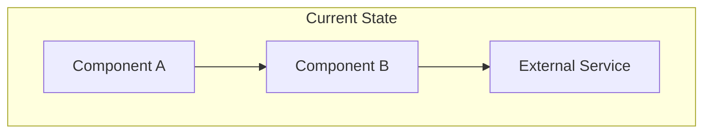
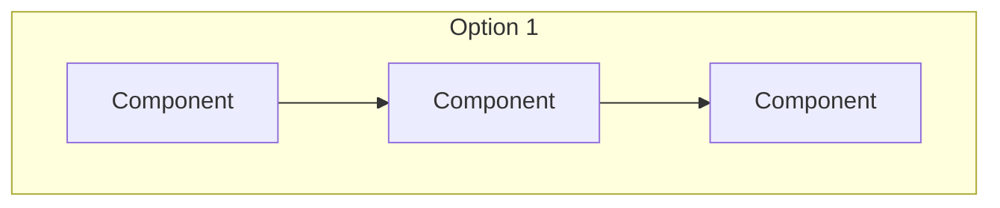
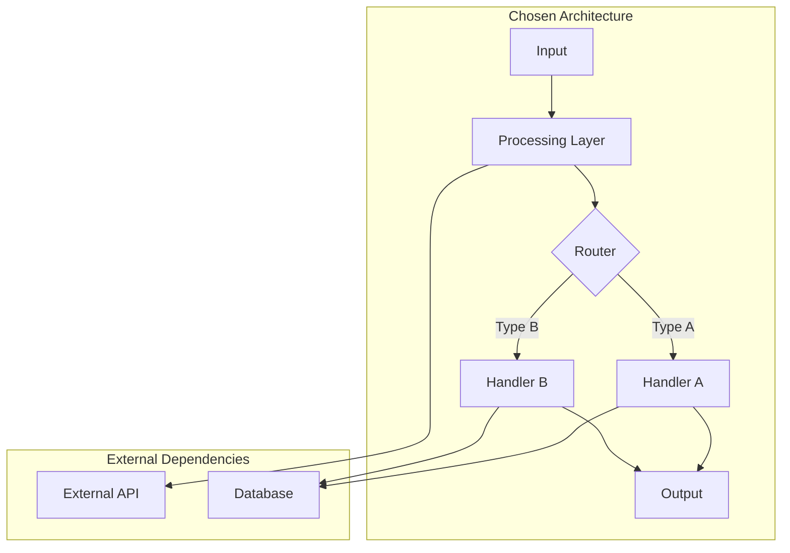
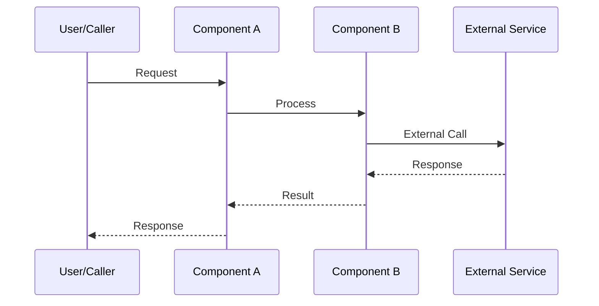
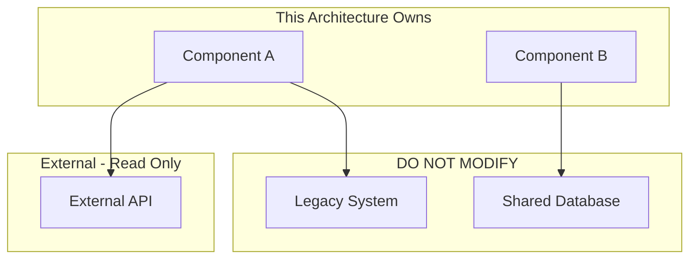

# [NNN]-ar-[slug]

> **Document Type:** Architecture Review  
> **Audience:** LLM agents, human reviewers  
> **Status:** Proposed | Accepted | Deprecated | Superseded  
> **Last Updated:** YYYY-MM-DD <!-- @auto -->  
> **Owner:** [name] <!-- @human-required -->  
> **Deciders:** [names/roles of decision makers] <!-- @human-required -->

---

## Review Tier Legend

| Marker | Tier | Speckit Behavior |
|--------|------|------------------|
| 🔴 `@human-required` | Human Generated | Prompt human to author; blocks until complete |
| 🟡 `@human-review` | LLM + Human Review | LLM drafts → prompt human to confirm/edit; blocks until confirmed |
| 🟢 `@llm-autonomous` | LLM Autonomous | LLM completes; no prompt; logged for audit |
| ⚪ `@auto` | Auto-generated | System fills (timestamps, links); no prompt |

---

## Document Completion Order

> ⚠️ **For LLM Agents:** Complete sections in this order. Do not fill downstream sections until upstream human-required inputs exist.

1. **Summary (Decision)** → requires human input first
2. **Context (Problem Space)** → requires human input
3. **Decision Drivers** → requires human input (prioritized)
4. **Driving Requirements** → extract from PRD, human confirms
5. **Options Considered** → LLM drafts after drivers exist, human reviews
6. **Decision (Selected + Rationale)** → requires human decision
7. **Implementation Guardrails** → LLM drafts, human reviews
8. **Everything else** → can proceed after decision is made

---

## Linkage ⚪ `@auto`

| Document | ID | Relationship |
|----------|-----|--------------|
| Parent PRD | [NNN]-prd-[slug].md | Requirements this architecture satisfies |
| Security Review | [NNN]-sec-[slug].md | Security implications of this decision |
| Supersedes | [NNN]-ar-[old-slug].md | Previous architecture (if applicable) |
| Superseded By | — | (Filled if this AR is deprecated) |

---

## Summary

### Decision 🔴 `@human-required`
> [One sentence: What architectural approach are we taking?]

### TL;DR for Agents 🟡 `@human-review`
> [2-3 sentences: The essential context an LLM needs before implementing. What pattern? What key constraints? What must NOT be done?]

---

## Context

### Problem Space 🔴 `@human-required`
[What architectural challenge does the PRD requirements create? Why is a decision needed?]

### Decision Scope 🟡 `@human-review`

<!-- Explicitly state what IS and IS NOT being decided to prevent architectural drift -->

**This AR decides:**
- [What architectural question this answers]
- [Scope boundary 1]

**This AR does NOT decide:**
- [Adjacent concern explicitly excluded]
- [Future decision deferred to another AR]

### Current State 🟢 `@llm-autonomous`
[Describe the existing architecture relevant to this decision. If greenfield, state "N/A - greenfield implementation".]



### Driving Requirements 🟡 `@human-review`

<!-- 
CRITICAL: Each requirement MUST reference a specific PRD requirement ID.
Do not invent or infer requirements — extract only from the linked PRD.
Human must confirm this mapping is accurate.
-->

| PRD Req ID | Requirement Summary | Architectural Implication |
|------------|---------------------|---------------------------|
| M-1 | [Summary from PRD] | [Why this drives architecture] |
| M-2 | [Summary from PRD] | [Why this drives architecture] |
| S-1 | [Summary from PRD] | [Why this drives architecture] |

**PRD Constraints inherited:**
- From PRD Technical Constraints: [constraint reference]
- Non-functional requirement: [e.g., must handle 1000 req/s]

---

## Decision Drivers 🔴 `@human-required`

[Ordered by priority — what factors most influence this decision?]

1. **[Driver 1]:** [e.g., Performance - must process in <100ms] *(traces to PRD M-1)*
2. **[Driver 2]:** [e.g., Maintainability - team must be able to extend easily]
3. **[Driver 3]:** [e.g., Cost - minimize cloud spend]
4. **[Driver 4]:** [e.g., Security - must not expose PII] *(traces to PRD M-3)*

---

## Options Considered 🟡 `@human-review`

<!-- 
All component/service names in diagrams MUST match names in the Component Overview table.
Maintain consistent terminology throughout.
-->

### Option 0: Status Quo / Do Nothing

<!-- 
REQUIRED unless greenfield. Forces explicit trade-off reasoning.
Why can't we just keep things as they are?
-->

**Description:** [What happens if we don't make this change?]

| Driver | Rating | Notes |
|--------|--------|-------|
| [Driver 1] | ❌ Poor | [Why status quo fails this driver] |
| [Driver 2] | ⚠️ Medium | [Assessment] |

**Why not viable:** [Explicit reason we cannot stay with status quo]

---

### Option 1: [Name]

**Description:** [Brief description of the approach]



| Driver | Rating | Notes |
|--------|--------|-------|
| [Driver 1] | ✅ Good | [Why — reference PRD req if applicable] |
| [Driver 2] | ⚠️ Medium | [Why] |
| [Driver 3] | ❌ Poor | [Why] |

**Pros:**
- [Advantage 1]
- [Advantage 2]

**Cons:**
- [Disadvantage 1]
- [Disadvantage 2]

---

### Option 2: [Name]

**Description:** [Brief description of the approach]


| Driver | Rating | Notes |
|--------|--------|-------|
| [Driver 1] | ⚠️ Medium | [Why] |
| [Driver 2] | ✅ Good | [Why] |
| [Driver 3] | ✅ Good | [Why] |

**Pros:**
- [Advantage 1]
- [Advantage 2]

**Cons:**
- [Disadvantage 1]
- [Disadvantage 2]

---

### Option 3: [Name] (if applicable)

[Same structure as above]

---

## Decision

### Selected Option 🔴 `@human-required`
> **Option [N]: [Name]**

### Rationale 🔴 `@human-required`

[Why this option over others? Reference the decision drivers and explain the trade-off reasoning.]

#### Simplest Implementation Comparison 🟡 `@human-review`

<!-- 
REQUIRED: Guards against over-engineering.
Compare selected option against the simplest possible approach.
-->

| Aspect | Simplest Possible | Selected Option | Justification for Complexity |
|--------|-------------------|-----------------|------------------------------|
| Components | [e.g., Single service] | [e.g., 3 microservices] | [Why needed — reference PRD req] |
| Dependencies | [e.g., stdlib only] | [e.g., 2 external crates] | [Why needed] |
| Patterns | [e.g., Direct calls] | [e.g., Event-driven] | [Why needed] |

**Complexity justified by:** [1-2 sentences explaining why the added complexity is necessary to meet PRD requirements]

### Architecture Diagram 🟡 `@human-review`

<!-- All component names MUST match the Component Overview table below -->



---

## Technical Specification

### Component Overview 🟡 `@human-review`

<!-- Canonical naming list — all diagrams must use these exact names -->

| Component | Responsibility | Interface | Dependencies |
|-----------|---------------|-----------|--------------|
| [Component A] | [What it does] | [API/CLI/Event] | [What it needs] |
| [Component B] | [What it does] | [API/CLI/Event] | [What it needs] |

### Data Flow 🟢 `@llm-autonomous`



### Interface Definitions 🟡 `@human-review`

```typescript
// Primary interface for this architecture
interface ComponentAInput {
  id: string;
  payload: PayloadType;
  options?: OptionsType;
}

interface ComponentAOutput {
  success: boolean;
  result?: ResultType;
  error?: {
    code: string;
    message: string;
  };
}
```

### Key Algorithms/Patterns 🟡 `@human-review`

[Describe any non-obvious algorithms or design patterns used]

**Pattern:** [e.g., Circuit Breaker]
```
Pseudocode or brief description:
1. Step one
2. Step two
3. Step three
```

---

## Constraints & Boundaries

### Technical Constraints 🟡 `@human-review`

<!-- Distinguish between inherited and new constraints -->

**Inherited from PRD:**
- [Constraint from PRD Technical Constraints section]
- [Another inherited constraint]

**Added by this Architecture:**
- **Language:** [e.g., Rust - no exceptions]
- **Dependencies:** [e.g., Only crates with >1000 downloads, MIT/Apache license]
- **Runtime:** [e.g., Must run in AWS Lambda, 512MB max memory]
- **Latency:** [e.g., p99 < 200ms]

### Architectural Boundaries 🟡 `@human-review`



- **Owns:** [Components this architecture has full control over]
- **Interfaces With:** [Components we call but don't own]
- **Must Not Touch:** [Components explicitly out of scope]

### Implementation Guardrails 🟡 `@human-review`

<!-- 
LLM drafts based on PRD constraints and Anti-patterns.
Human must review and confirm these are the correct guardrails.
-->

> ⚠️ **Critical for LLM Agents:**

- [ ] **DO NOT** [specific anti-pattern or forbidden approach] *(from PRD constraint X)*
- [ ] **DO NOT** [another forbidden approach]
- [ ] **MUST** [required pattern or approach] *(satisfies PRD M-1)*
- [ ] **MUST** [another required pattern]

---

## Consequences 🟡 `@human-review`

### Positive
- [Benefit 1 that results from this decision]
- [Benefit 2 that results from this decision]

### Negative
- [Trade-off 1 we're accepting]
- [Trade-off 2 we're accepting]

### Risks & Mitigations

| Risk | Likelihood | Impact | Mitigation |
|------|------------|--------|------------|
| [Risk 1] | Medium | High | [How we address it] |
| [Risk 2] | Low | Medium | [How we address it] |

---

## Implementation Guidance

### Suggested Implementation Order 🟢 `@llm-autonomous`
1. [First component/layer to build]
2. [Second component/layer to build]
3. [Integration points]
4. [Final assembly]

### Testing Strategy 🟢 `@llm-autonomous`

| Layer | Test Type | Coverage Target | Notes |
|-------|-----------|-----------------|-------|
| Unit | [Component A] | 80% | Focus on [X] |
| Integration | [A ↔ B] | Key paths | Mock [External] |
| E2E | Full flow | Happy path + errors | |

### Reference Implementations 🟡 `@human-review`

<!-- 
LLM may suggest references, but human must validate:
- Internal references preferred
- External links must be approved (quality, compatibility, licensing)
-->

- [Link to similar pattern in codebase] *(internal)*
- [Link to external example if applicable] *(requires human approval)*

### Anti-patterns to Avoid 🟡 `@human-review`
- **Don't:** [Specific thing not to do]
  - **Why:** [Consequence if done]
  - **Instead:** [What to do instead]

---

## Compliance & Cross-cutting Concerns

### Security Considerations 🟡 `@human-review`
[Brief note — full details in Security Review document]
- Authentication: [approach]
- Authorization: [approach]
- Data handling: [approach]

### Observability 🟢 `@llm-autonomous`
- **Logging:** [What to log, format]
- **Metrics:** [Key metrics to emit]
- **Tracing:** [Trace points]

### Error Handling Strategy 🟢 `@llm-autonomous`
```
Error Category → Handling Approach
├── Transient errors → Retry with backoff
├── Validation errors → Return 4xx, no retry
├── System errors → Log, alert, return 5xx
└── External failures → Circuit breaker, fallback
```

---

## Migration Plan (if applicable) 🟡 `@human-review`

### From Current State to Target State

```mermaid
gantt
    title Migration Phases
    dateFormat  YYYY-MM-DD
    section Phase 1
    Build new components    :a1, YYYY-MM-DD, 14d
    section Phase 2
    Parallel run            :a2, after a1, 7d
    section Phase 3
    Cutover                 :a3, after a2, 3d
    section Phase 4
    Deprecate old           :a4, after a3, 7d
```

### Rollback Plan 🔴 `@human-required`

**Rollback Triggers:**
<!-- What conditions trigger a rollback decision? -->
- [Trigger 1 — e.g., Error rate exceeds 5% for 10 minutes]
- [Trigger 2 — e.g., P99 latency exceeds 500ms]

**Rollback Decision Authority:** [Who can authorize rollback]

**Rollback Time Window:** [How long after deployment is rollback viable]

**Rollback Procedure:**
[Step-by-step how to revert if this architecture fails in production]

---

## Open Questions 🟡 `@human-review`

- [ ] **Q1:** [Unresolved architectural question]
- [ ] **Q2:** [Unresolved architectural question]

---

## Changelog ⚪ `@auto`

| Version | Date | Author | Changes |
|---------|------|--------|---------|
| 0.1 | YYYY-MM-DD | [name] | Initial proposal |
| 1.0 | YYYY-MM-DD | [name] | Accepted after review |

---

## Decision Record ⚪ `@auto`

| Date | Event | Details |
|------|-------|---------|
| YYYY-MM-DD | Proposed | Initial draft created |
| YYYY-MM-DD | Reviewed | Feedback from [reviewers] |
| YYYY-MM-DD | Accepted | Approved by [deciders] |

---

## Traceability Matrix 🟢 `@llm-autonomous`

<!-- Ensures all PRD requirements are addressed by this architecture -->

| PRD Req ID | Decision Driver | Option Rating | Component | Notes |
|------------|-----------------|---------------|-----------|-------|
| M-1 | Driver 1 | Option 2: ✅ | Component A | [How satisfied] |
| M-2 | Driver 2 | Option 2: ⚠️ | Component B | [How satisfied] |
| S-1 | — | Option 2: ✅ | Component A | [How satisfied] |

---

## Review Checklist 🟢 `@llm-autonomous`

Before marking as Accepted:
- [ ] All PRD Must Have requirements appear in Driving Requirements
- [ ] Option 0 (Status Quo) is documented unless greenfield
- [ ] Simplest Implementation comparison is completed
- [ ] Decision drivers are prioritized and addressed
- [ ] At least 2 options were seriously considered
- [ ] Constraints distinguish inherited vs. new
- [ ] Component names are consistent across all diagrams and tables
- [ ] Implementation guardrails reference specific PRD constraints
- [ ] Rollback triggers and authority are defined
- [ ] Security review is linked or N/A documented
- [ ] No open questions blocking implementation
