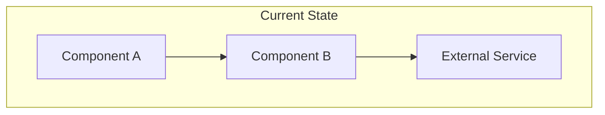
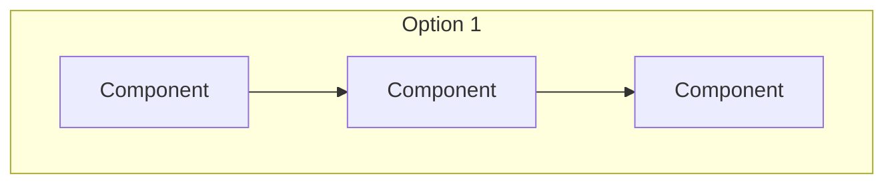
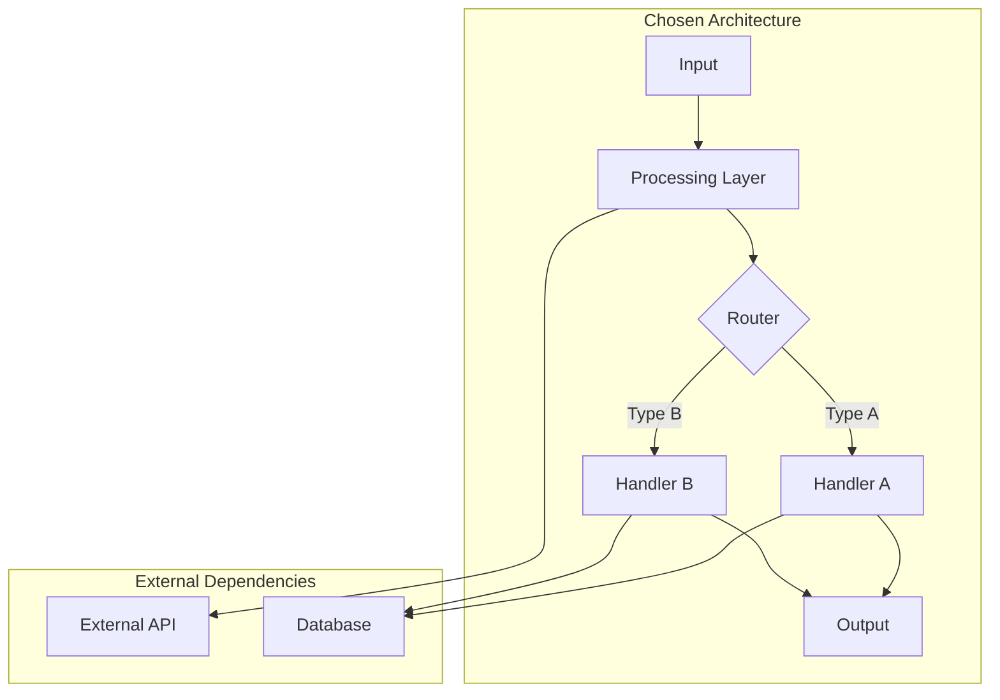
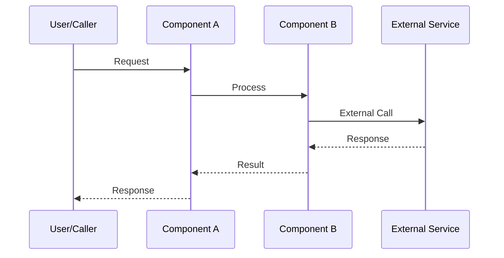
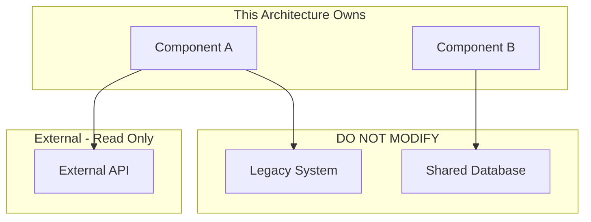
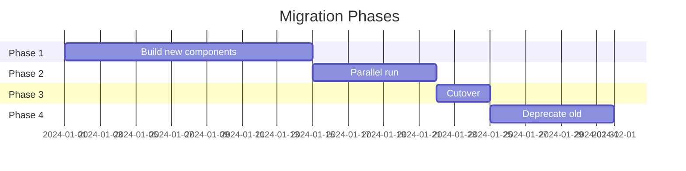

# [NNN]-ard-[slug]

> **Document Type:** Architecture Decision Record  
> **Audience:** LLM agents, human reviewers  
> **Status:** Proposed | Accepted | Deprecated | Superseded  
> **Last Updated:** YYYY-MM-DD <!-- @auto -->  
> **Owner:** [name] <!-- @human-required -->  
> **Deciders:** [names/roles of decision makers] <!-- @human-required -->

---

## Review Tier Legend

| Marker | Tier | Speckit Behavior |
|--------|------|------------------|
| 🔴 `@human-required` | Human Generated | Prompt human to author; blocks until complete |
| 🟡 `@human-review` | LLM + Human Review | LLM drafts → prompt human to confirm/edit; blocks until confirmed |
| 🟢 `@llm-autonomous` | LLM Autonomous | LLM completes; no prompt; logged for audit |
| ⚪ `@auto` | Auto-generated | System fills (timestamps, links); no prompt |

---

## Linkage ⚪ `@auto`

| Document | ID | Relationship |
|----------|-----|--------------|
| Parent PRD | [NNN]-prd-[slug].md | Requirements this architecture satisfies |
| Security Review | [NNN]-sec-[slug].md | Security implications of this decision |
| Supersedes | [NNN]-ard-[old-slug].md | Previous architecture (if applicable) |
| Superseded By | — | (Filled if this ARD is deprecated) |

---

## Summary

### Decision 🔴 `@human-required`
> [One sentence: What architectural approach are we taking?]

### TL;DR for Agents 🟡 `@human-review`
> [2-3 sentences: The essential context an LLM needs before implementing. What pattern? What key constraints? What must NOT be done?]

---

## Context

### Problem Space 🔴 `@human-required`
[What architectural challenge does the PRD requirements create? Why is a decision needed?]

### Current State 🟢 `@llm-autonomous`
[Describe the existing architecture relevant to this decision. If greenfield, state "N/A - greenfield implementation".]



### Driving Requirements 🟢 `@llm-autonomous`
[Extract the specific requirements from the PRD that drive this architectural decision]

- From PRD Must Have: [requirement reference]
- From PRD Constraints: [constraint reference]
- Non-functional requirement: [e.g., must handle 1000 req/s]

---

## Decision Drivers 🔴 `@human-required`

[Ordered by priority — what factors most influence this decision?]

1. **[Driver 1]:** [e.g., Performance - must process in <100ms]
2. **[Driver 2]:** [e.g., Maintainability - team must be able to extend easily]
3. **[Driver 3]:** [e.g., Cost - minimize cloud spend]
4. **[Driver 4]:** [e.g., Security - must not expose PII]

---

## Options Considered 🟡 `@human-review`

### Option 1: [Name]

**Description:** [Brief description of the approach]



| Driver | Rating | Notes |
|--------|--------|-------|
| Performance | ✅ Good | [Why] |
| Maintainability | ⚠️ Medium | [Why] |
| Cost | ❌ Poor | [Why] |

**Pros:**
- [Advantage 1]
- [Advantage 2]

**Cons:**
- [Disadvantage 1]
- [Disadvantage 2]

---

### Option 2: [Name]

**Description:** [Brief description of the approach]


| Driver | Rating | Notes |
|--------|--------|-------|
| Performance | ⚠️ Medium | [Why] |
| Maintainability | ✅ Good | [Why] |
| Cost | ✅ Good | [Why] |

**Pros:**
- [Advantage 1]
- [Advantage 2]

**Cons:**
- [Disadvantage 1]
- [Disadvantage 2]

---

### Option 3: [Name] (if applicable)

[Same structure as above]

---

## Decision

### Selected Option 🔴 `@human-required`
> **Option [N]: [Name]**

### Rationale 🔴 `@human-required`
[Why this option over others? Reference the decision drivers and explain the trade-off reasoning.]

### Architecture Diagram 🟡 `@human-review`



---

## Technical Specification

### Component Overview 🟡 `@human-review`

| Component | Responsibility | Interface | Dependencies |
|-----------|---------------|-----------|--------------|
| [Component A] | [What it does] | [API/CLI/Event] | [What it needs] |
| [Component B] | [What it does] | [API/CLI/Event] | [What it needs] |

### Data Flow 🟢 `@llm-autonomous`



### Interface Definitions 🟡 `@human-review`

```typescript
// Primary interface for this architecture
interface ComponentAInput {
  id: string;
  payload: PayloadType;
  options?: OptionsType;
}

interface ComponentAOutput {
  success: boolean;
  result?: ResultType;
  error?: {
    code: string;
    message: string;
  };
}
```

### Key Algorithms/Patterns 🟡 `@human-review`

[Describe any non-obvious algorithms or design patterns used]

**Pattern:** [e.g., Circuit Breaker]
```
Pseudocode or brief description:
1. Step one
2. Step two
3. Step three
```

---

## Constraints & Boundaries

### Technical Constraints 🟡 `@human-review`
[Hard limits that MUST be respected during implementation]

- **Language:** [e.g., Rust - no exceptions]
- **Dependencies:** [e.g., Only crates with >1000 downloads, MIT/Apache license]
- **Runtime:** [e.g., Must run in AWS Lambda, 512MB max memory]
- **Latency:** [e.g., p99 < 200ms]

### Architectural Boundaries 🟡 `@human-review`



- **Owns:** [Components this architecture has full control over]
- **Interfaces With:** [Components we call but don't own]
- **Must Not Touch:** [Components explicitly out of scope]

### Implementation Guardrails 🔴 `@human-required`

> ⚠️ **Critical for LLM Agents:**

- [ ] DO NOT [specific anti-pattern or forbidden approach]
- [ ] DO NOT [another forbidden approach]
- [ ] MUST [required pattern or approach]
- [ ] MUST [another required pattern]

---

## Consequences 🟡 `@human-review`

### Positive
- [Benefit 1 that results from this decision]
- [Benefit 2 that results from this decision]

### Negative
- [Trade-off 1 we're accepting]
- [Trade-off 2 we're accepting]

### Risks & Mitigations

| Risk | Likelihood | Impact | Mitigation |
|------|------------|--------|------------|
| [Risk 1] | Medium | High | [How we address it] |
| [Risk 2] | Low | Medium | [How we address it] |

---

## Implementation Guidance

### Suggested Implementation Order 🟢 `@llm-autonomous`
1. [First component/layer to build]
2. [Second component/layer to build]
3. [Integration points]
4. [Final assembly]

### Testing Strategy 🟢 `@llm-autonomous`

| Layer | Test Type | Coverage Target | Notes |
|-------|-----------|-----------------|-------|
| Unit | [Component A] | 80% | Focus on [X] |
| Integration | [A ↔ B] | Key paths | Mock [External] |
| E2E | Full flow | Happy path + errors | |

### Reference Implementations 🟢 `@llm-autonomous`
- [Link to similar pattern in codebase]
- [Link to external example if applicable]

### Anti-patterns to Avoid 🟡 `@human-review`
- **Don't:** [Specific thing not to do]
  - **Why:** [Consequence if done]
  - **Instead:** [What to do instead]

---

## Compliance & Cross-cutting Concerns

### Security Considerations 🟡 `@human-review`
[Brief note — full details in Security Review document]
- Authentication: [approach]
- Authorization: [approach]
- Data handling: [approach]

### Observability 🟢 `@llm-autonomous`
- **Logging:** [What to log, format]
- **Metrics:** [Key metrics to emit]
- **Tracing:** [Trace points]

### Error Handling Strategy 🟢 `@llm-autonomous`
```
Error Category → Handling Approach
├── Transient errors → Retry with backoff
├── Validation errors → Return 4xx, no retry
├── System errors → Log, alert, return 5xx
└── External failures → Circuit breaker, fallback
```

---

## Migration Plan (if applicable) 🟡 `@human-review`

### From Current State to Target State



### Rollback Plan 🔴 `@human-required`
[How to revert if this architecture fails in production]

---

## Open Questions 🟡 `@human-review`

- [ ] **Q1:** [Unresolved architectural question]
- [ ] **Q2:** [Unresolved architectural question]

---

## Changelog ⚪ `@auto`

| Version | Date | Author | Changes |
|---------|------|--------|---------|
| 0.1 | YYYY-MM-DD | [name] | Initial proposal |
| 1.0 | YYYY-MM-DD | [name] | Accepted after review |

---

## Decision Record ⚪ `@auto`

| Date | Event | Details |
|------|-------|---------|
| YYYY-MM-DD | Proposed | Initial draft created |
| YYYY-MM-DD | Reviewed | Feedback from [reviewers] |
| YYYY-MM-DD | Accepted | Approved by [deciders] |

---

## Review Checklist 🟢 `@llm-autonomous`

Before marking as Accepted:
- [ ] All PRD requirements can be satisfied by this architecture
- [ ] Decision drivers are prioritized and addressed
- [ ] At least 2 options were seriously considered
- [ ] Constraints and boundaries are explicit
- [ ] Implementation guardrails are clear for LLM agents
- [ ] Security review is linked or N/A documented
- [ ] No open questions blocking implementation
