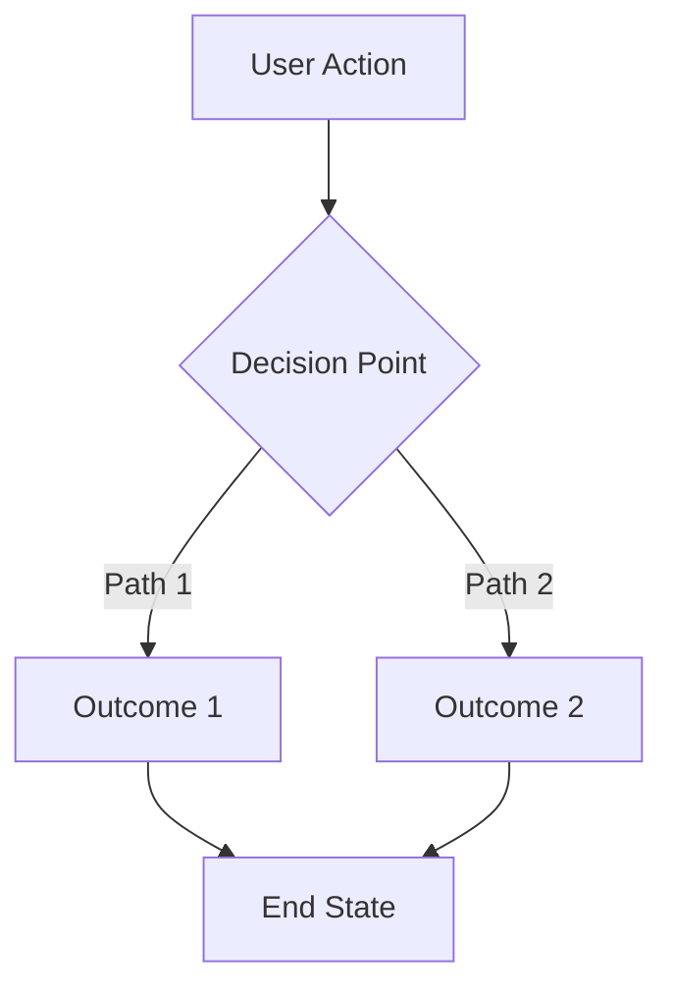
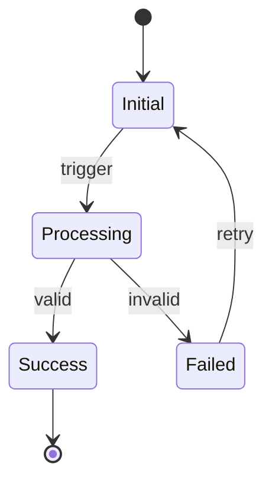
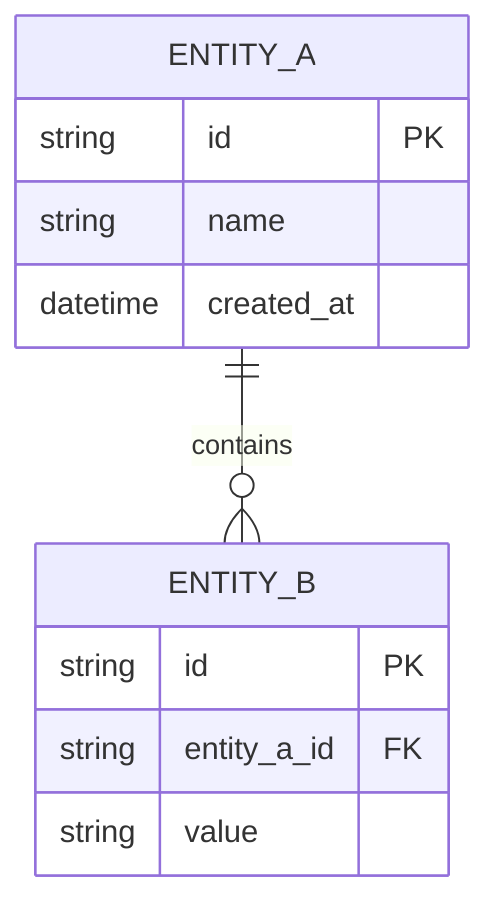
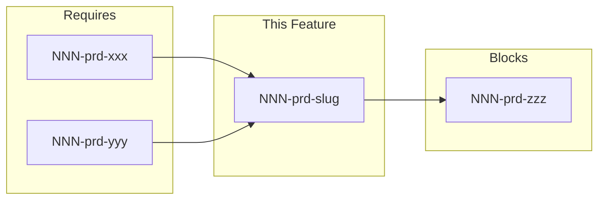

# [NNN]-prd-[slug]

> **Document Type:** Product Requirements Document  
> **Audience:** LLM agents, human reviewers  
> **Status:** Draft | In Review | Approved | In Progress | Complete  
> **Last Updated:** YYYY-MM-DD <!-- @auto -->  
> **Owner:** [name] <!-- @human-required -->

---

## Review Tier Legend

| Marker | Tier | Speckit Behavior |
|--------|------|------------------|
| 🔴 `@human-required` | Human Generated | Prompt human to author; blocks until complete |
| 🟡 `@human-review` | LLM + Human Review | LLM drafts → prompt human to confirm/edit; blocks until confirmed |
| 🟢 `@llm-autonomous` | LLM Autonomous | LLM completes; no prompt; logged for audit |
| ⚪ `@auto` | Auto-generated | System fills (timestamps, links); no prompt |

---

## Context

### Background 🔴 `@human-required`
[2-3 sentences: Why does this feature exist? What user pain or business need drives it? Link to parent roadmap item if applicable.]

### Scope Boundaries 🟡 `@human-review`
**In Scope:**
- [Explicit list of what this PRD covers]

**Out of Scope:**
- [Explicit list of what this PRD does NOT cover - critical for preventing LLM drift]

### Related Documents ⚪ `@auto`
| Document | Link | Relationship |
|----------|------|--------------|
| Architecture Decision Record | [NNN]-ard-[slug].md | Defines technical approach |
| Security Review | [NNN]-sec-[slug].md | Risk assessment |
| Parent Roadmap | roadmap.md#[section] | Strategic context |

---

## Problem Statement 🔴 `@human-required`

[1-2 paragraphs: What gap does this fill? Who experiences the problem? What is the cost of not solving it?]

### User Story 🔴 `@human-required`
> As a [persona], I want [capability] so that [benefit].

---

## Feature Overview

### Flow Diagram 🟡 `@human-review`


### State Diagram (if applicable) 🟡 `@human-review`


---

## Requirements

### Must Have (M) — MVP, launch blockers 🔴 `@human-required`
- [ ] [Requirement with clear, testable language]
- [ ] [Use "shall" for requirements, "should" for preferences]

### Should Have (S) — High value, not blocking 🔴 `@human-required`
- [ ] ...

### Could Have (C) — Nice to have, if time permits 🟡 `@human-review`
- [ ] ...

### Won't Have (W) — Explicitly deferred 🟡 `@human-review`
- [ ] [Important: document WHY deferred]

---

## Technical Constraints 🟡 `@human-review`

[List any technical guardrails the implementing agent must respect]

- **Language/Framework:** [e.g., Rust, must use existing crate X]
- **Performance:** [e.g., must complete in <100ms]
- **Compatibility:** [e.g., must support API v2 and v3]
- **Dependencies:** [e.g., cannot add new external dependencies without approval]

---

## Data Model (if applicable) 🟡 `@human-review`



---

## Interface Contract (if applicable) 🟡 `@human-review`

```typescript
// Input
interface FeatureInput {
  requiredField: string;
  optionalField?: number;
}

// Output
interface FeatureOutput {
  success: boolean;
  data?: ResultType;
  error?: ErrorType;
}
```

---

## Evaluation Criteria 🟡 `@human-review`

| Criterion | Weight | Metric | Target | Notes |
|-----------|--------|--------|--------|-------|
| [e.g., Performance] | High | Response time | <100ms p95 | |
| [e.g., Accuracy] | Critical | Error rate | <0.1% | |

---

## Tool/Approach Candidates 🟢 `@llm-autonomous`

| Option | License | Pros | Cons | Spike Result |
|--------|---------|------|------|--------------|
| Option A | | | | |
| Option B | | | | |

### Selected Approach 🔴 `@human-required`
> **Decision:** [Filled after spike]  
> **Rationale:** [Why this option over others]

---

## Acceptance Criteria 🟡 `@human-review`

[Use Given/When/Then format - directly translatable to tests]

- [ ] **AC-1:** Given [precondition], when [action], then [expected result]
- [ ] **AC-2:** Given [precondition], when [action], then [expected result]

### Edge Cases 🟢 `@llm-autonomous`
- [ ] **EC-1:** When [edge condition], then [expected behavior]

---

## Dependencies 🟢 `@llm-autonomous`



- **Requires:** none | NNN-prd-xxx
- **Blocks:** none | NNN-prd-xxx
- **External:** [any external system dependencies]

---

## Implementation Guidance 🟢 `@llm-autonomous`

### Suggested Approach
[Optional: High-level implementation hints for the coding agent. Not prescriptive, but helpful context.]

### Anti-patterns to Avoid
- [Known pitfalls or approaches that have failed before]

### Reference Examples
- [Links to similar implementations or patterns to follow]

---

## Spike Tasks 🟡 `@human-review`

- [ ] **Spike-1:** [Investigation task with clear completion criteria]
- [ ] **Spike-2:** [Investigation task with clear completion criteria]

---

## Success Metrics 🔴 `@human-required`

| Metric | Baseline | Target | Measurement Method |
|--------|----------|--------|-------------------|
| [e.g., Task completion rate] | N/A | 95% | Automated testing |

---

## Changelog ⚪ `@auto`

| Version | Date | Author | Changes |
|---------|------|--------|---------|
| 0.1 | YYYY-MM-DD | [name] | Initial draft |
| 0.2 | YYYY-MM-DD | [name] | Added X based on review |

---

## Decision Log 🟡 `@human-review`

| Date | Decision | Rationale | Alternatives Considered |
|------|----------|-----------|------------------------|
| YYYY-MM-DD | [What was decided] | [Why] | [What else was considered] |

---

## Open Questions 🟡 `@human-review`

- [ ] **Q1:** [Unresolved question that needs input]
- [ ] **Q2:** [Unresolved question that needs input]

---

## Review Checklist 🟢 `@llm-autonomous`

Before marking as Approved:
- [ ] Problem statement is clear and validated
- [ ] All Must Have requirements have acceptance criteria
- [ ] Security review completed (or N/A documented)
- [ ] Dependencies identified and owners notified
- [ ] No open questions blocking implementation
