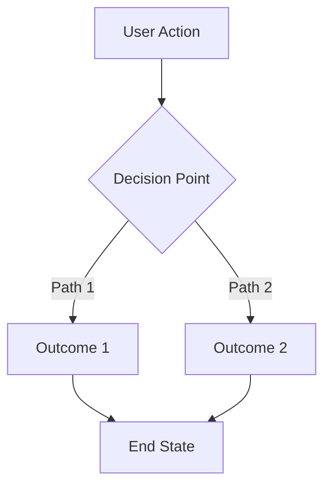
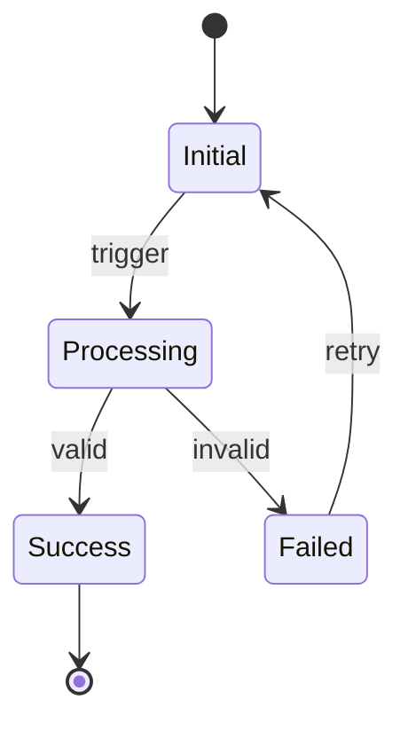
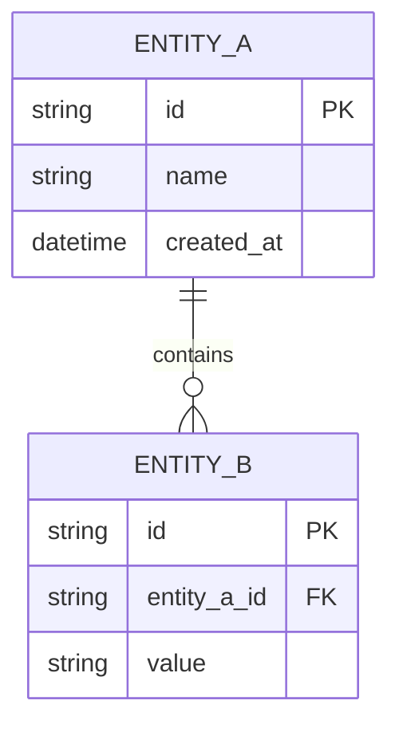
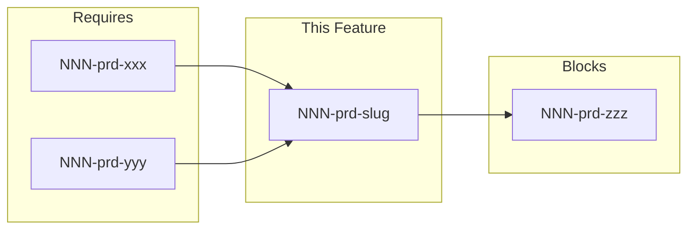

# [NNN]-prd-[slug]

> **Document Type:** Product Requirements Document  
> **Audience:** LLM agents, human reviewers  
> **Status:** Draft | Ready for Review | Approved | In Progress | Complete  
> **Last Updated:** YYYY-MM-DD <!-- @auto -->  
> **Owner:** [name] <!-- @human-required -->

---
<!-- Legend: 🔴 @human-required | 🟡 @human-review | 🟢 @llm-autonomous | ⚪ @auto -->
> **Context Required for Agents:** [List 1-3 critical file paths the agent MUST read before implementing] <!-- @human-required -->

---

## Document Completion Order

> ⚠️ **For LLM Agents:** Complete sections in this order. Do not fill downstream sections until upstream human-required inputs exist.

1. **Context** (Background, Scope) → requires human input first
2. **Problem Statement & User Story** → requires human input
3. **Requirements** (Must/Should/Could/Won't) → requires human input
4. **Technical Constraints** → human review
5. **Diagrams, Data Model, Interface** → LLM can draft after above exist
6. **Acceptance Criteria** → derived from requirements
7. **Everything else** → can proceed

---

## Context

### Background 🔴 `@human-required`
[2-3 sentences: Why does this feature exist? What user pain or business need drives it? Link to parent roadmap item if applicable.]

### Scope Boundaries 🟡 `@human-review`

**In Scope:**
- [Explicit list of what this PRD covers]

**Out of Scope:**
<!-- List "near-miss" items — features that might seem related but are explicitly excluded to prevent scope drift. -->
- [Explicitly excluded item 1 — why excluded]
- [Explicitly excluded item 2 — why excluded]

### Glossary 🟡 `@human-review`

<!-- Define domain-specific terms, abbreviations, and key concepts. LLM agents should use these terms consistently throughout all documents. -->

| Term | Definition |
|------|------------|
| [Term 1] | [Definition] |
| [Term 2] | [Definition] |

### Related Documents ⚪ `@auto`

| Document | Link | Relationship |
|----------|------|--------------|
| Architecture Review | [NNN]-ar-[slug].md | Defines technical approach |
| Security Review | [NNN]-sec-[slug].md | Risk assessment |
| Parent Roadmap | roadmap.md#[section] | Strategic context |

---

## Problem Statement 🔴 `@human-required`

[1-2 paragraphs: What gap does this fill? Who experiences the problem? What is the cost of not solving it?]

### User Story 🔴 `@human-required`
> As a [persona], I want [capability] so that [benefit].

---

## Assumptions & Risks 🟡 `@human-review`

### Assumptions
<!-- What are we assuming to be true? If these assumptions are wrong, the requirements may need to change. -->
- [A-1] [Assumption — e.g., "Users have valid API keys before using this feature"]
- [A-2] [Assumption]

### Risks
<!-- What could go wrong? What external factors could impact this feature? -->
| ID | Risk | Likelihood | Impact | Mitigation |
|----|------|------------|--------|------------|
| R-1 | [Risk description] | [Low/Med/High] | [Low/Med/High] | [How addressed] |

---

## Feature Overview

### Flow Diagram 🟡 `@human-review`

<!-- Ensure diagram terminology matches Glossary and Requirements section. -->



### State Diagram (if applicable) 🟡 `@human-review`


---

## Requirements

<!-- 
IMPORTANT: Each requirement MUST have a unique ID for traceability.
Format: [Priority]-[Number] (e.g., M-1, S-2, C-1, W-1)
Acceptance Criteria must reference these IDs.
AR and SEC documents will trace back to these IDs.
-->
<!-- @agent: Do not invent requirements. Only extract from the Problem Statement. Use strict MUST/SHOULD/COULD formats. -->

### Must Have (M) — MVP, launch blockers 🔴 `@human-required`
- [ ] **M-1:** [Requirement with clear, testable language using "shall"]
- [ ] **M-2:** [Requirement]

### Should Have (S) — High value, not blocking 🔴 `@human-required`
- [ ] **S-1:** [Requirement]
- [ ] **S-2:** [Requirement]

### Could Have (C) — Nice to have, if time permits 🟡 `@human-review`
- [ ] **C-1:** [Requirement]

### Won't Have (W) — Explicitly deferred 🟡 `@human-review`
<!-- Document WHY each item is deferred -->
- [ ] **W-1:** [Deferred item] — *Reason: [why deferred]*

---

## Technical Constraints 🟡 `@human-review`

[List any technical guardrails the implementing agent must respect]

- **Language/Framework:** [e.g., Rust, must use existing crate X]
- **Performance:** [e.g., must complete in <100ms]
- **Compatibility:** [e.g., must support API v2 and v3]
- **Dependencies:** [e.g., cannot add new external dependencies without approval]

---

## Data Model (if applicable) 🟡 `@human-review`

<!-- 
@human-review: Ensure this defines WHAT is needed (fields, relationships), 
not HOW it is implemented (database-specific types, indexes). 
Implementation details belong in the AR.
-->



---

## Interface Contract (if applicable) 🟡 `@human-review`

<!-- 
@human-review: Ensure this defines the CONTRACT (inputs/outputs), 
not the implementation. Avoid over-committing to specific libraries or patterns.
-->

```typescript
// Input
interface FeatureInput {
  requiredField: string;
  optionalField?: number;
}

// Output
interface FeatureOutput {
  success: boolean;
  data?: ResultType;
  error?: ErrorType;
}
```

---

## Evaluation Criteria 🟡 `@human-review`

| Criterion | Weight | Metric | Target | Notes |
|-----------|--------|--------|--------|-------|
| [e.g., Performance] | High | Response time | <100ms p95 | |
| [e.g., Accuracy] | Critical | Error rate | <0.1% | |

---

## Tool/Approach Candidates 🟡 `@human-review`

<!-- 
LLM may draft this section, but human must validate:
- License compatibility
- Security posture of dependencies  
- Team familiarity
- Long-term maintenance burden
-->

| Option | License | Pros | Cons | Spike Result |
|--------|---------|------|------|--------------|
| Option A | | | | |
| Option B | | | | |

### Selected Approach 🔴 `@human-required`
> **Decision:** [Filled after spike]  
> **Rationale:** [Why this option over others]

---

## Acceptance Criteria 🟡 `@human-review`

<!-- 
Each AC must reference a Requirement ID.
Use Given/When/Then format — directly translatable to tests.
-->

| AC ID | Requirement | Given | When | Then | Target File | Test Command |
|-------|-------------|-------|------|------|-------------|--------------|
| AC-1 | M-1 | [precondition] | [action] | [expected result] | [e.g., src/api/routes.ts] | [e.g., npm test src/api/routes.test.ts] |
| AC-2 | M-2 | [precondition] | [action] | [expected result] | [e.g., src/api/routes.ts] | [e.g., npm test src/api/routes.test.ts] |
| AC-3 | S-1 | [precondition] | [action] | [expected result] | [e.g., src/api/routes.ts] | [e.g., npm test src/api/routes.test.ts] |

### Edge Cases 🟢 `@llm-autonomous`
- [ ] **EC-1:** (M-1) When [edge condition], then [expected behavior]
- [ ] **EC-2:** (M-2) When [edge condition], then [expected behavior]

---

## Dependencies 🟡 `@human-review`

<!-- 
LLM may draft based on context, but human must validate:
- Ownership of dependencies
- Timeline alignment
- External system constraints
-->



- **Requires:** none | NNN-prd-xxx
- **Blocks:** none | NNN-prd-xxx
- **External:** [any external system dependencies]

---

## Security Considerations 🟡 `@human-review`

<!-- 
Brief assessment of security implications. 
Full details in the linked Security Review document.
-->

| Aspect | Assessment | Notes |
|--------|------------|-------|
| Internet Exposure | [Yes/No] | [What is exposed] |
| Sensitive Data | [Yes/No] | [What classification level] |
| Authentication Required | [Yes/No] | [Method] |
| Security Review Required | [Yes/No/N/A] | [Link to [NNN]-sec-[slug].md or justification for N/A] |

---

## Implementation Guidance 🟢 `@llm-autonomous`

### Suggested Approach
[Optional: High-level implementation hints for the coding agent. Not prescriptive, but helpful context.]

### Anti-patterns to Avoid
- [Known pitfalls or approaches that have failed before]

### Reference Examples
- [Links to similar implementations or patterns to follow]

---

## Spike Tasks 🟡 `@human-review`

- [ ] **Spike-1:** [Investigation task with clear completion criteria]
- [ ] **Spike-2:** [Investigation task with clear completion criteria]

---

## Success Metrics 🔴 `@human-required`

| Metric | Baseline | Target | Measurement Method |
|--------|----------|--------|-------------------|
| [e.g., Task completion rate] | N/A | 95% | Automated testing |

### Technical Verification 🟢 `@llm-autonomous`
<!-- Metrics the implementing agent can verify during development -->
| Metric | Target | Verification Method |
|--------|--------|---------------------|
| Test coverage for Must Have ACs | >90% | CI pipeline |
| No Critical/High security findings | 0 | Security review |

---

## Definition of Ready 🔴 `@human-required`

<!-- 
This section serves as a formal gate before implementation begins.
All items must be checked before proceeding to AR or implementation.
-->

### Readiness Checklist
- [ ] Problem statement reviewed and validated by stakeholder
- [ ] All Must Have requirements have acceptance criteria
- [ ] Technical constraints are explicit and agreed
- [ ] Dependencies identified and owners confirmed
- [ ] Security review completed (or N/A documented with justification)
- [ ] No open questions blocking implementation

### Sign-off
| Role | Name | Date | Decision |
|------|------|------|----------|
| Product Owner | [name] | YYYY-MM-DD | [Ready / Not Ready] |

---

## Decision Log 🟡 `@human-review`

| Date | Decision | Rationale | Alternatives Considered |
|------|----------|-----------|------------------------|
| YYYY-MM-DD | [What was decided] | [Why] | [What else was considered] |

---

## Open Questions 🟡 `@human-review`

- [ ] **Q1:** [Unresolved question that needs input]
- [ ] **Q2:** [Unresolved question that needs input]

---

## Review Checklist 🟢 `@llm-autonomous`

Before marking as Approved:
- [ ] Agent has verified all requirements have unique IDs (M-1, S-2, etc.)
- [ ] Agent has verified all Must Have requirements have linked acceptance criteria
- [ ] Agent has verified Glossary terms are used consistently throughout
- [ ] Agent has verified Diagrams use terminology from Glossary
- [ ] Agent has verified Security considerations are documented (or N/A justified)
- [ ] Agent has verified Definition of Ready checklist is complete
- [ ] Agent has verified No open questions blocking implementation
