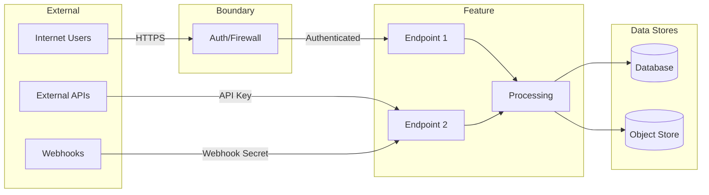
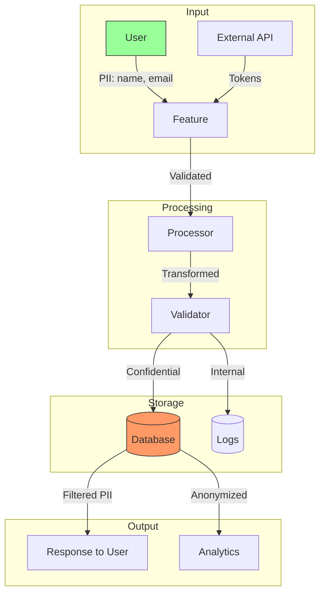
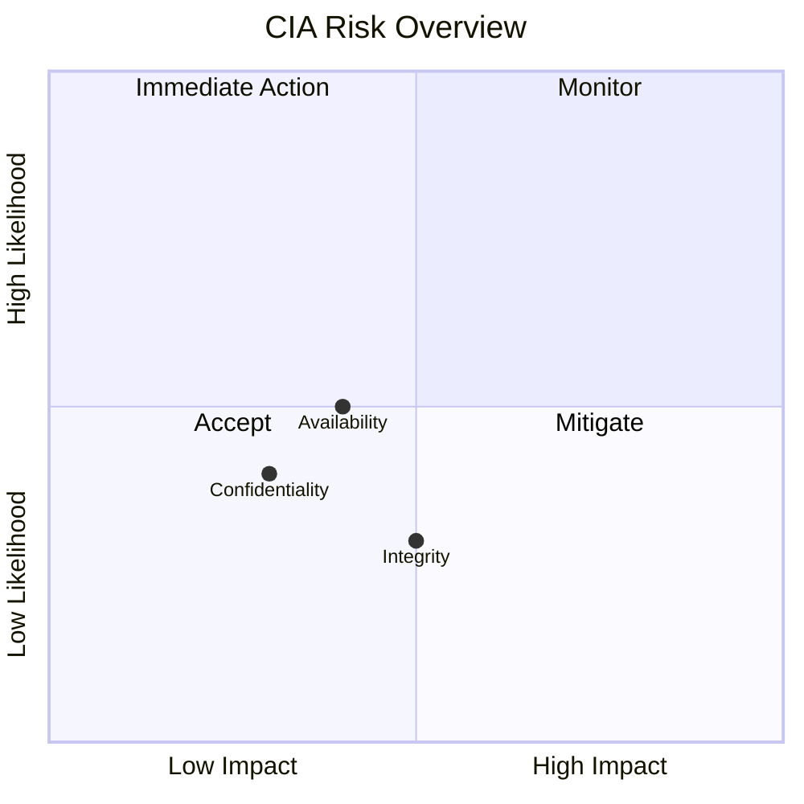
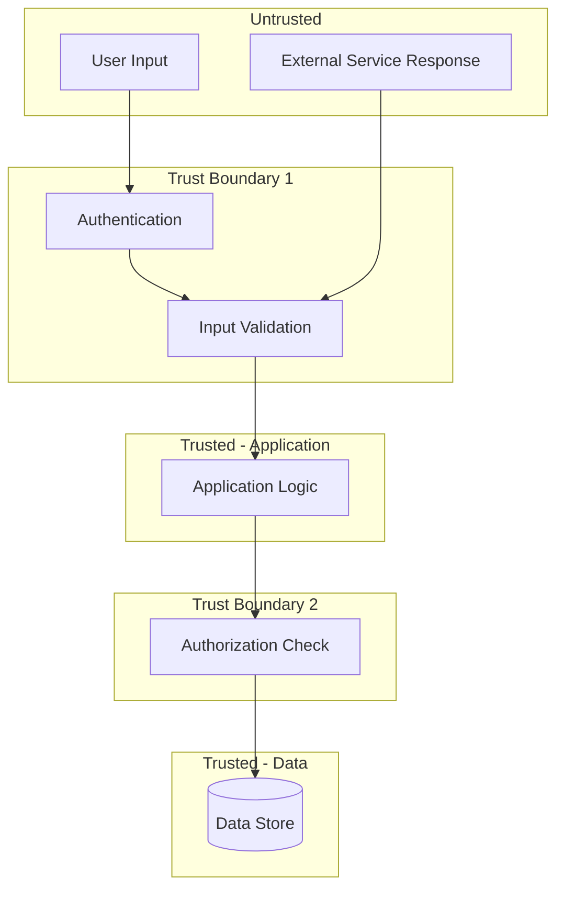

# [NNN]-sec-[slug]

> **Document Type:** Security Review (Lightweight)  
> **Audience:** LLM agents, human reviewers  
> **Status:** Draft | In Review | Approved | Flagged for Deep Review  
> **Last Updated:** YYYY-MM-DD <!-- @auto -->  
> **Reviewer:** [name] <!-- @human-required -->  
> **Risk Level:** Low | Medium | High | Critical <!-- @human-required -->

---

## Review Tier Legend

| Marker | Tier | Speckit Behavior |
|--------|------|------------------|
| 🔴 `@human-required` | Human Generated | Prompt human to author; blocks until complete |
| 🟡 `@human-review` | LLM + Human Review | LLM drafts → prompt human to confirm/edit; blocks until confirmed |
| 🟢 `@llm-autonomous` | LLM Autonomous | LLM completes; no prompt; logged for audit |
| ⚪ `@auto` | Auto-generated | System fills (timestamps, links); no prompt |

---

## Linkage ⚪ `@auto`

| Document | ID | Relationship |
|----------|-----|--------------|
| Parent PRD | [NNN]-prd-[slug].md | Feature being reviewed |
| Architecture Decision Record | [NNN]-ard-[slug].md | Technical implementation |

---

## Purpose

This is a **lightweight security review** intended to catch obvious security concerns early in the product lifecycle. It is NOT a comprehensive threat model. Full threat modeling should occur during implementation when infrastructure-as-code and concrete implementations exist.

**This review answers three questions:**
1. What does this feature expose to attackers?
2. What data does it touch, and how sensitive is that data?
3. What's the impact if something goes wrong?

---

## Feature Security Summary

### One-line Summary 🔴 `@human-required`
> [What does this feature do from a security perspective?]

### Risk Assessment 🔴 `@human-required`
> **Risk Level:** [Low | Medium | High | Critical]  
> **Justification:** [One sentence justification]

---

## Attack Surface Analysis

### Exposure Points 🟡 `@human-review`

What entry points does this feature create or modify?

| Exposure Type | Details | Authentication | Authorization | Notes |
|---------------|---------|----------------|---------------|-------|
| Public Internet Endpoint | [e.g., API at /api/v1/resource] | [Yes/No - method] | [Yes/No - method] | |
| Internal Network Endpoint | [e.g., gRPC service] | [Yes/No - method] | [Yes/No - method] | |
| User Input Field | [e.g., file upload, form field] | — | — | [Validation?] |
| Webhook/Callback | [e.g., receives events from X] | [Yes/No - method] | — | |
| Scheduled Job | [e.g., cron, Lambda schedule] | — | — | |
| Message Queue Consumer | [e.g., SQS, Kafka topic] | — | — | |
| None | Feature has no external exposure | — | — | |

### Attack Surface Diagram 🟢 `@llm-autonomous`

### Exposure Checklist 🟢 `@llm-autonomous`

Quick validation of common exposure risks:

- [ ] **Internet-facing endpoints require authentication**
- [ ] **No sensitive data in URL parameters** (query strings logged, cached, leaked via referrer)
- [ ] **File uploads validated** (type, size, content) if applicable
- [ ] **Rate limiting configured** for public endpoints
- [ ] **CORS policy is restrictive** (not `*`) if applicable
- [ ] **No debug/admin endpoints exposed** in production
- [ ] **Webhooks validate signatures** if receiving external events

---

## Data Flow Analysis

### Data Inventory 🟡 `@human-review`

What data does this feature collect, process, store, or transmit?

| Data Element | Classification | Source | Destination | Retention | Encrypted at Rest | Encrypted in Transit |
|--------------|----------------|--------|-------------|-----------|-------------------|---------------------|
| [e.g., User email] | Confidential | User input | PostgreSQL | 2 years | Yes | Yes |
| [e.g., API logs] | Internal | System | CloudWatch | 30 days | Yes | Yes |
| [e.g., Payment token] | Restricted | Stripe API | Memory only | None | N/A | Yes |

### Data Classification Reference 🟢 `@llm-autonomous`

| Level | Label | Description | Examples | Handling Requirements |
|-------|-------|-------------|----------|----------------------|
| 1 | **Public** | No impact if disclosed | Marketing content, public docs | No special handling |
| 2 | **Internal** | Minor impact if disclosed | Internal configs, non-sensitive logs | Access controls, no public exposure |
| 3 | **Confidential** | Significant impact if disclosed | PII, user data, credentials | Encryption, audit logging, access controls |
| 4 | **Restricted** | Severe impact if disclosed | Payment data, health records, secrets | Encryption, strict access, compliance requirements |

### Data Flow Diagram 🟢 `@llm-autonomous`

### Data Handling Checklist 🟢 `@llm-autonomous`

- [ ] **No Restricted data stored unless absolutely required**
- [ ] **Confidential data encrypted at rest**
- [ ] **All data encrypted in transit (TLS 1.2+)**
- [ ] **PII has defined retention policy**
- [ ] **Logs do not contain Confidential/Restricted data** (or are properly secured)
- [ ] **Secrets are not hardcoded** (use secret manager)
- [ ] **Data minimization applied** (only collect what's needed)

---

## CIA Impact Assessment

If this feature is compromised, what's the impact?

### Confidentiality 🟡 `@human-review`

> **What could be disclosed?**

| Asset at Risk | Classification | Exposure Scenario | Impact | Likelihood |
|---------------|----------------|-------------------|--------|------------|
| [e.g., User emails] | Confidential | SQL injection, access control bypass | Medium | Low |
| [e.g., Internal config] | Internal | Log exposure, error messages | Low | Medium |

**Confidentiality Risk Level:** [Low | Medium | High]

### Integrity 🟡 `@human-review`

> **What could be modified or corrupted?**

| Asset at Risk | Modification Scenario | Impact | Likelihood |
|---------------|----------------------|--------|------------|
| [e.g., User profile] | Unauthorized update via IDOR | Medium | Low |
| [e.g., Transaction record] | Tampering via API manipulation | High | Low |

**Integrity Risk Level:** [Low | Medium | High]

### Availability 🟡 `@human-review`

> **What could be disrupted?**

| Service/Function | Disruption Scenario | Impact | Likelihood |
|------------------|---------------------|--------|------------|
| [e.g., API endpoint] | DoS via resource exhaustion | Medium | Medium |
| [e.g., Database] | Connection pool exhaustion | High | Low |

**Availability Risk Level:** [Low | Medium | High]

### CIA Summary 🟢 `@llm-autonomous`

---

## Trust Boundaries 🟡 `@human-review`

Where does trust change in this feature?

### Trust Boundary Checklist 🟢 `@llm-autonomous`

- [ ] **All input from untrusted sources is validated**
- [ ] **External API responses are validated** (don't trust external services blindly)
- [ ] **Authorization checked at data access, not just entry point**
- [ ] **Service-to-service calls are authenticated** (not just network isolation)

---

## Known Risks & Mitigations 🟡 `@human-review`

| ID | Risk Description | Severity | Mitigation | Status | Owner |
|----|------------------|----------|------------|--------|-------|
| R1 | [Describe the risk] | [Low/Med/High/Crit] | [How it's addressed] | [Open/Mitigated/Accepted] | [who] |
| R2 | [Describe the risk] | [Low/Med/High/Crit] | [How it's addressed] | [Open/Mitigated/Accepted] | [who] |

### Risk Acceptance 🔴 `@human-required`

If risks are being accepted rather than mitigated:

| Risk ID | Accepted By | Date | Justification | Review Date |
|---------|-------------|------|---------------|-------------|
| R1 | [name] | YYYY-MM-DD | [Why accepting] | YYYY-MM-DD |

---

## Security Requirements 🟡 `@human-review`

Based on this review, the implementation MUST satisfy:

### Authentication & Authorization
- [ ] [Specific requirement, e.g., "All /api/* endpoints require valid JWT"]
- [ ] [Specific requirement, e.g., "Resource access must validate ownership"]

### Data Protection
- [ ] [Specific requirement, e.g., "User PII must be encrypted with AES-256 at rest"]
- [ ] [Specific requirement, e.g., "Logs must not contain email addresses"]

### Input Validation
- [ ] [Specific requirement, e.g., "File uploads limited to 10MB, image types only"]
- [ ] [Specific requirement, e.g., "All string inputs sanitized for XSS"]

### Operational Security
- [ ] [Specific requirement, e.g., "Failed auth attempts logged with IP"]
- [ ] [Specific requirement, e.g., "Rate limit: 100 req/min per user"]

---

## Compliance Considerations 🟡 `@human-review`

Does this feature have regulatory implications?

| Regulation | Applicable? | Relevant Requirements | Notes |
|------------|-------------|----------------------|-------|
| GDPR | [Yes/No] | [e.g., Right to deletion, consent] | |
| CCPA | [Yes/No] | [e.g., Data disclosure] | |
| SOC 2 | [Yes/No] | [e.g., Access controls, logging] | |
| HIPAA | [Yes/No] | [e.g., PHI handling] | |
| PCI-DSS | [Yes/No] | [e.g., Payment data handling] | |
| Other | [Yes/No] | [Specify] | |

---

## Review Findings

### Issues Identified 🟡 `@human-review`

| ID | Finding | Severity | Category | Recommendation | Status |
|----|---------|----------|----------|----------------|--------|
| F1 | [What was found] | [Low/Med/High/Crit] | [Exposure/Data/CIA] | [What to do] | [Open/Resolved] |
| F2 | [What was found] | [Low/Med/High/Crit] | [Exposure/Data/CIA] | [What to do] | [Open/Resolved] |

### Positive Observations 🟢 `@llm-autonomous`

- [Security-positive aspect of the design]
- [Another good security practice observed]

---

## Open Questions 🟡 `@human-review`

- [ ] **Q1:** [Unresolved security question]
- [ ] **Q2:** [Unresolved security question]

---

## Changelog ⚪ `@auto`

| Version | Date | Author | Changes |
|---------|------|--------|---------|
| 0.1 | YYYY-MM-DD | [name] | Initial review |
| 0.2 | YYYY-MM-DD | [name] | Updated after PRD revision |

---

## Review Sign-off 🔴 `@human-required`

| Role | Name | Date | Decision |
|------|------|------|----------|
| Security Reviewer | [name] | YYYY-MM-DD | [Approved / Approved with conditions / Rejected] |
| Feature Owner | [name] | YYYY-MM-DD | [Acknowledged] |

### Conditions for Approval (if applicable) 🔴 `@human-required`

- [ ] [Condition that must be met before implementation proceeds]
- [ ] [Another condition]

---

## Review Checklist 🟢 `@llm-autonomous`

Before marking as Approved:
- [ ] Attack surface is documented with auth/authz status
- [ ] All data elements are classified
- [ ] CIA impact is assessed for each risk level
- [ ] Trust boundaries are identified
- [ ] Security requirements are specific and testable
- [ ] No Critical/High findings remain Open
- [ ] Compliance implications are documented (or N/A)
