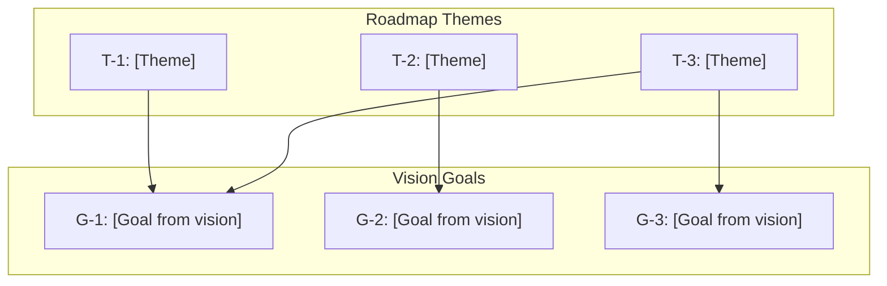
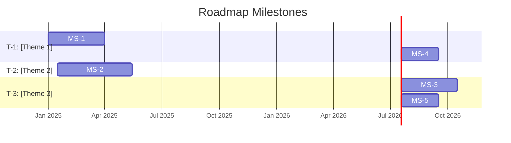
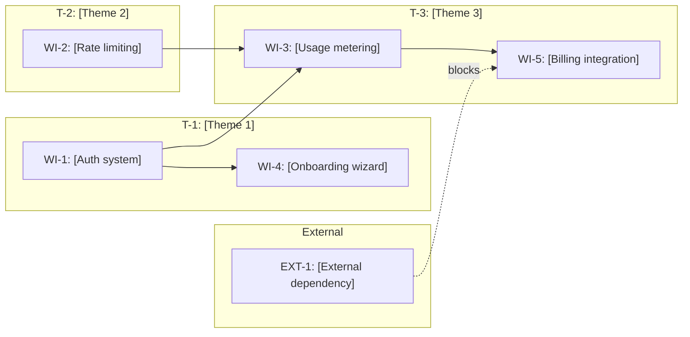
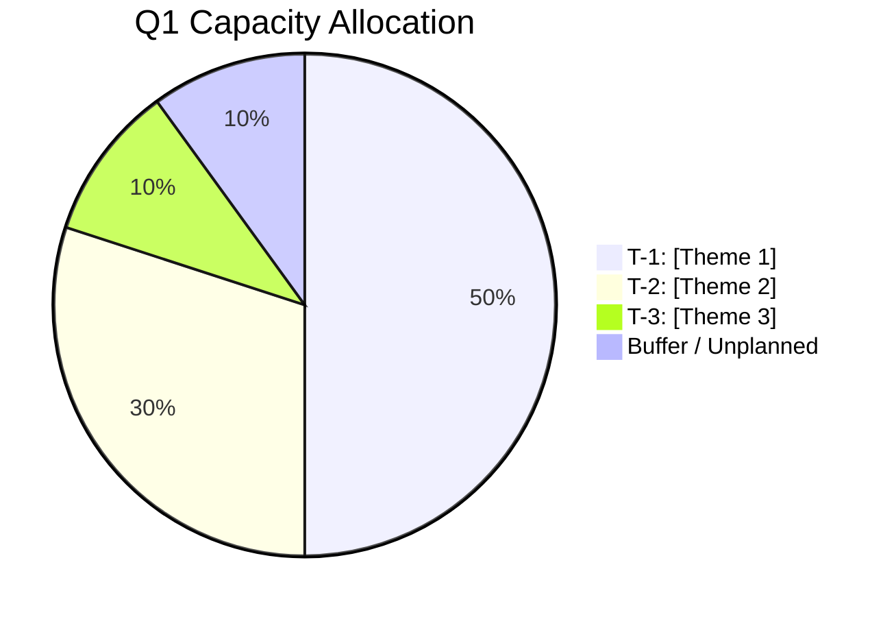
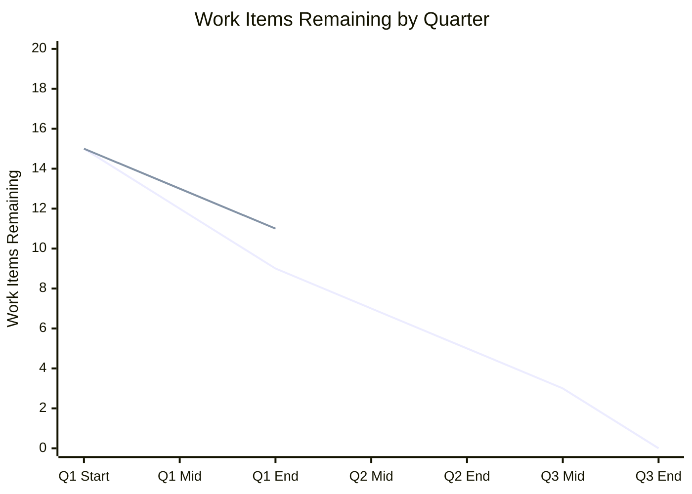

# [NNN]-roadmap-[slug]

> **Document Type:** Product Roadmap  
> **Audience:** LLM agents, human reviewers, leadership stakeholders, engineering leads  
> **Status:** Draft | Ready for Review | Approved | Active | Archived  
> **Last Updated:** YYYY-MM-DD <!-- @auto -->  
> **Owner:** [name] <!-- @human-required -->  
> **Parent Vision:** [NNN]-vision-[slug].md <!-- @auto -->

---

## Review Tier Legend

| Marker | Tier | Speckit Behavior |
|--------|------|------------------|
| 🔴 `@human-required` | Human Generated | Prompt human to author; blocks until complete |
| 🟡 `@human-review` | LLM + Human Review | LLM drafts → prompt human to confirm/edit; blocks until confirmed |
| 🟢 `@llm-autonomous` | LLM Autonomous | LLM completes; no prompt; logged for audit |
| ⚪ `@auto` | Auto-generated | System fills (timestamps, links); no prompt |

---

## Document Completion Order

> ⚠️ **For LLM Agents:** Complete sections in this order. Do not fill downstream sections until upstream human-required inputs exist. This document requires an approved Vision document as input.

1. **Roadmap Context & Planning Parameters** → requires human input first
2. **Themes & Milestone Definitions** → requires human input
3. **Work Item Registry** → requires human input per item, LLM assists with traceability
4. **Timeline & Sequencing** → LLM can draft based on dependencies, human reviews
5. **Resource Allocation & Capacity** → requires human input
6. **Risk & Dependencies** → LLM can draft, human reviews
7. **Status Tracking & Health** → ongoing, LLM can maintain

---

## Roadmap Context

### Purpose 🔴 `@human-required`

<!-- 
Why does this roadmap exist as a distinct document? What planning horizon does it cover?
A roadmap is NOT a release plan or sprint backlog — it communicates strategic intent and sequencing.
-->

> [1-2 sentences: What does this roadmap communicate, and to whom? e.g., "This roadmap translates our product vision into a sequenced execution plan for the next 12 months, aligning engineering, design, and leadership on priorities and trade-offs."]

### Planning Parameters 🔴 `@human-required`

| Parameter | Value |
|-----------|-------|
| **Time Horizon** | [e.g., 12 months] |
| **Planning Cadence** | [e.g., Reviewed quarterly, updated monthly] |
| **Confidence Model** | [e.g., "Current quarter = committed, next quarter = planned, beyond = exploratory"] |
| **Capacity Basis** | [e.g., "2 engineers, 1 designer, 60% feature time after maintenance"] |

### Confidence Levels 🟡 `@human-review`

<!-- Define what each confidence level means for your team. Downstream sections reference these. -->

| Level | Label | Meaning | Can Change? |
|-------|-------|---------|-------------|
| 🟢 | Committed | Actively in progress or fully scoped and approved | Only with escalation |
| 🟡 | Planned | Scoped, estimated, sequenced — but not yet started | Yes, with notice |
| 🟠 | Exploratory | Directionally agreed — scope and timing are flexible | Freely |
| ⚪ | Aspirational | On the radar but no commitment — may not happen this horizon | May be cut entirely |

### Glossary 🟡 `@human-review`

<!-- Inherit from Vision document and extend with roadmap-specific terms. -->

| Term | Definition |
|------|------------|
| Theme | A strategic area of investment that groups related work items |
| Milestone | A meaningful checkpoint with exit criteria — not a date on a calendar |
| Work Item | A unit of deliverable work (maps to a PRD or spike) |
| Dependency | A work item or external factor that must be resolved before another can proceed |

### Related Documents ⚪ `@auto`

| Document | Link | Relationship |
|----------|------|--------------|
| Product Vision | [NNN]-vision-[slug].md | Strategic goals and principles this roadmap executes against |
| PRD Index | prd-index.md | Feature-level documents linked from work items |
| Capacity Plan | [NNN]-capacity-[slug].md | Resource availability backing this plan |

---

## Strategic Alignment

### Vision Traceability 🟢 `@llm-autonomous`

<!-- Auto-maintained. Every theme and work item must trace to a strategic goal from the Vision document. -->

### Goal Coverage Check 🟢 `@llm-autonomous`

<!-- Audit: Are all vision goals represented? Are any themes orphaned (no goal linkage)? -->

| Vision Goal | Mapped Themes | Coverage Status |
|-------------|---------------|-----------------|
| G-1 | T-1, T-3 | ✅ Covered |
| G-2 | T-2 | ✅ Covered |
| G-3 | T-3 | ✅ Covered |
| G-4 | — | ⚠️ No theme mapped — intentional? |

---

## Themes 🔴 `@human-required`

<!-- 
Themes are strategic areas of investment, NOT feature names.
Good themes: "Developer Onboarding", "Data Pipeline Reliability", "Self-Serve Monetization"
Bad themes: "Add OAuth", "Fix bug #412", "Build dashboard"
Each theme must link to at least one Vision strategic goal.
-->

| ID | Theme | Description | Strategic Goal(s) | Owner | Horizon |
|----|-------|-------------|-------------------|-------|---------|
| T-1 | [e.g., "Developer Onboarding"] | [What this investment area achieves] | G-1 | [name] | [e.g., Q1–Q2] |
| T-2 | [e.g., "Core Platform Reliability"] | [What this investment area achieves] | G-2 | [name] | [e.g., Q1–Q3] |
| T-3 | [e.g., "Monetization Foundation"] | [What this investment area achieves] | G-1, G-3 | [name] | [e.g., Q2–Q4] |

### Theme Prioritization 🔴 `@human-required`

<!-- 
Stack rank themes. When resources are constrained, higher-ranked themes get staffed first.
This is the single most important prioritization decision in the roadmap.
-->

| Rank | Theme | Rationale |
|------|-------|-----------|
| 1 | T-1: [Theme] | [Why this comes first] |
| 2 | T-2: [Theme] | [Why this follows] |
| 3 | T-3: [Theme] | [Why this is lower priority] |

---

## Milestones 🔴 `@human-required`

<!-- 
Milestones are meaningful checkpoints — not arbitrary dates.
Each milestone should represent a state where the product delivers NEW user value or unlocks a strategic capability.
A milestone is reached when ALL its exit criteria are met, not when a date arrives.
-->

| ID | Milestone | Theme(s) | Target Date | Confidence | Exit Criteria |
|----|-----------|----------|-------------|------------|---------------|
| MS-1 | [e.g., "First user completes onboarding end-to-end"] | T-1 | YYYY-MM-DD | 🟢 Committed | [What must be true] |
| MS-2 | [e.g., "Core API handles 500 req/s under load test"] | T-2 | YYYY-MM-DD | 🟡 Planned | [What must be true] |
| MS-3 | [e.g., "First paying customer on self-serve plan"] | T-3 | YYYY-MM-DD | 🟠 Exploratory | [What must be true] |

### Milestone Timeline 🟡 `@human-review`

---

## Work Item Registry

<!-- 
Each work item is a deliverable unit of work — typically mapping 1:1 to a PRD.
This is the master list. Sequencing and dependencies are handled in later sections.
-->

### Registry 🟡 `@human-review`

<!-- 
LLM can draft entries from existing PRDs. Human must validate priority, sizing, and assignments.
Size uses T-shirt sizing: XS (<1 week), S (1-2 weeks), M (2-4 weeks), L (1-2 months), XL (2+ months)
-->

| ID | Work Item | Theme | Milestone | PRD Link | Size | Confidence | Owner | Status |
|----|-----------|-------|-----------|----------|------|------------|-------|--------|
| WI-1 | [e.g., "Auth system — OAuth + API key flow"] | T-1 | MS-1 | [NNN]-prd-[slug] | M | 🟢 | [name] | Not Started |
| WI-2 | [e.g., "Rate limiting & circuit breakers"] | T-2 | MS-2 | [NNN]-prd-[slug] | S | 🟢 | [name] | In Progress |
| WI-3 | [e.g., "Usage metering pipeline"] | T-3 | MS-3 | [NNN]-prd-[slug] | L | 🟡 | [name] | Not Started |
| WI-4 | [e.g., "Interactive onboarding wizard"] | T-1 | MS-1 | [NNN]-prd-[slug] | M | 🟡 | [name] | Not Started |
| WI-5 | [e.g., "Stripe integration for self-serve billing"] | T-3 | MS-3 | — | L | 🟠 | TBD | Needs PRD |

### Work Item Status Key 🟢 `@llm-autonomous`

| Status | Meaning |
|--------|---------|
| Needs PRD | Work item identified but no PRD exists yet |
| Not Started | PRD exists, not yet in development |
| In Progress | Actively being developed |
| In Review | Development complete, under review or testing |
| Done | Shipped and verified against acceptance criteria |
| Blocked | Cannot proceed — see Dependencies section |
| Cut | Removed from this roadmap cycle — see Decision Log |

---

## Sequencing & Dependencies

### Dependency Map 🟡 `@human-review`

<!-- 
LLM drafts from work item relationships. Human validates that the critical path is correct
and that external dependencies are accurately captured.
-->

### Dependency Registry 🟡 `@human-review`

| ID | Blocked Item | Depends On | Type | Owner | Status | Risk if Late |
|----|-------------|------------|------|-------|--------|--------------|
| D-1 | WI-4 | WI-1 | Internal | [name] | On Track | MS-1 slips |
| D-2 | WI-3 | WI-1 | Internal | [name] | On Track | MS-3 slips |
| D-3 | WI-3 | WI-2 | Internal | [name] | On Track | MS-3 slips |
| D-4 | WI-5 | WI-3 | Internal | [name] | On Track | MS-3 slips |
| D-5 | WI-5 | EXT-1: [External dep] | External | [ext. contact] | At Risk | MS-3 blocked |

### Critical Path 🟢 `@llm-autonomous`

<!-- Auto-derived from dependency map. The longest chain of sequential dependencies. -->

> **Critical Path:** WI-1 → WI-3 → WI-5 → MS-3
>
> **Total estimated duration:** [X weeks]  
> **Slack:** [Y weeks before target date]  
> **Bottleneck:** [Which item has the least margin]

---

## Resource Allocation 🔴 `@human-required`

### Team Capacity

<!-- 
Define available capacity per period. Account for maintenance, on-call, meetings, and other overhead.
"Feature capacity" = total capacity minus non-feature obligations.
-->

| Role | Person | Q1 Feature % | Q2 Feature % | Q3 Feature % | Q4 Feature % | Notes |
|------|--------|-------------|-------------|-------------|-------------|-------|
| Eng | [name] | [e.g., 60%] | [e.g., 60%] | [e.g., 70%] | [e.g., 70%] | [e.g., "On-call rotation Q1–Q2"] |
| Eng | [name] | [e.g., 80%] | [e.g., 80%] | [e.g., 80%] | [e.g., 60%] | [e.g., "Ramping down in Q4"] |
| Design | [name] | [e.g., 50%] | [e.g., 50%] | [e.g., 50%] | [e.g., 50%] | [e.g., "Shared with other product"] |

### Allocation by Theme 🟡 `@human-review`

<!-- How is feature capacity distributed across themes each quarter? Must sum to ~100%. -->

| Theme | Q1 | Q2 | Q3 | Q4 |
|-------|----|----|----|----|
| T-1: [Theme 1] | 50% | 30% | 10% | 10% |
| T-2: [Theme 2] | 30% | 30% | 20% | 20% |
| T-3: [Theme 3] | 10% | 30% | 50% | 50% |
| Buffer / Unplanned | 10% | 10% | 20% | 20% |

### Over-Allocation Check 🟢 `@llm-autonomous`

<!-- Audit: Does the work assigned per quarter exceed available capacity? -->

| Quarter | Available Capacity | Allocated Capacity | Status |
|---------|-------------------|-------------------|--------|
| Q1 | [X person-weeks] | [Y person-weeks] | ✅ / ⚠️ / 🔴 |
| Q2 | [X person-weeks] | [Y person-weeks] | ✅ / ⚠️ / 🔴 |
| Q3 | [X person-weeks] | [Y person-weeks] | ✅ / ⚠️ / 🔴 |
| Q4 | [X person-weeks] | [Y person-weeks] | ✅ / ⚠️ / 🔴 |

---

## Risks & Mitigations 🟡 `@human-review`

<!-- 
Roadmap-level risks. These are about execution and sequencing, not product design.
Product-level risks live in the Vision document. Feature-level risks live in PRDs.
-->

| ID | Risk | Affected Items | Likelihood | Impact | Mitigation | Contingency |
|----|------|---------------|------------|--------|------------|-------------|
| RR-1 | [e.g., "Key engineer leaves mid-Q2"] | WI-2, WI-3 | Low | High | [e.g., "Cross-training plan in Q1"] | [e.g., "Descope WI-3 to Phase 2"] |
| RR-2 | [e.g., "External API partner delays integration"] | WI-5, MS-3 | Med | High | [e.g., "Weekly sync with partner"] | [e.g., "Build mock integration, defer live connection"] |
| RR-3 | [e.g., "Scope creep in T-1 pushes T-3 into next cycle"] | T-3, MS-3 | Med | Med | [e.g., "Hard scope freeze after PRD approval"] | [e.g., "Cut C-priority items from T-1 PRDs"] |

---

## Trade-off Decisions 🔴 `@human-required`

<!-- 
Pre-decide common trade-offs so the team doesn't relitigate them mid-execution.
These should be consistent with Product Principles in the Vision document.
-->

| When faced with... | We choose... | Over... | Rationale |
|---------------------|-------------|---------|-----------|
| [e.g., "Scope vs. timeline"] | [e.g., "Cut scope"] | [e.g., "Slip the date"] | [e.g., "Milestone dates are committed to partners"] |
| [e.g., "Polish vs. coverage"] | [e.g., "Cover more use cases roughly"] | [e.g., "Polish fewer use cases deeply"] | [e.g., "Learning > perfection in Phase 1"] |
| [e.g., "Build vs. buy"] | [e.g., "Buy/integrate if saves >2 weeks"] | [e.g., "Build custom"] | [e.g., "Team is small, time is the bottleneck"] |

---

## Roadmap Health Dashboard 🟢 `@llm-autonomous`

<!-- 
Updated each review cycle. Provides at-a-glance status for leadership.
LLM auto-generates from work item statuses and milestone progress.
-->

### Milestone Health

| Milestone | Target Date | Status | On Track? | Blockers |
|-----------|-------------|--------|-----------|----------|
| MS-1 | YYYY-MM-DD | [X of Y work items done] | ✅ / ⚠️ / 🔴 | [None / list] |
| MS-2 | YYYY-MM-DD | [X of Y work items done] | ✅ / ⚠️ / 🔴 | [None / list] |
| MS-3 | YYYY-MM-DD | [X of Y work items done] | ✅ / ⚠️ / 🔴 | [None / list] |

### Theme Health

| Theme | Work Items Total | Done | In Progress | Blocked | Not Started | Health |
|-------|-----------------|------|-------------|---------|-------------|--------|
| T-1 | [n] | [n] | [n] | [n] | [n] | ✅ / ⚠️ / 🔴 |
| T-2 | [n] | [n] | [n] | [n] | [n] | ✅ / ⚠️ / 🔴 |
| T-3 | [n] | [n] | [n] | [n] | [n] | ✅ / ⚠️ / 🔴 |

### Burndown Summary 🟡 `@human-review`

---

## Review & Governance

### Review Cadence 🔴 `@human-required`

| Review Type | Frequency | Attendees | Purpose |
|-------------|-----------|-----------|---------|
| [e.g., "Roadmap Sync"] | [e.g., "Monthly"] | [e.g., "PM, Eng Lead, Design"] | [e.g., "Update statuses, re-sequence if needed"] |
| [e.g., "Quarterly Planning"] | [e.g., "Quarterly"] | [e.g., "Leadership + full team"] | [e.g., "Re-prioritize themes, update allocations"] |
| [e.g., "Milestone Review"] | [e.g., "At each milestone"] | [e.g., "PM, Eng Lead, stakeholders"] | [e.g., "Evaluate exit criteria, decide go/no-go"] |

### Change Control 🟡 `@human-review`

<!-- What level of change requires what level of approval? Prevents both chaos and bureaucracy. -->

| Change Type | Example | Approval Required |
|-------------|---------|-------------------|
| Work item re-sequenced within same milestone | Move WI-3 before WI-4 | Theme owner |
| Work item moved to different milestone | WI-5 from MS-2 to MS-3 | Product owner |
| Milestone date moved | MS-2 slips 3 weeks | Product owner + eng lead |
| Theme added or removed | New theme T-4 added | Leadership sign-off |
| Work item cut from roadmap | WI-5 removed entirely | Product owner — log in Decision Log |

---

## Definition of Ready 🔴 `@human-required`

<!-- 
Gate before this roadmap moves from Draft to Active.
An Active roadmap means the team is executing against it.
-->

### Readiness Checklist

- [ ] Parent Vision document is Approved
- [ ] All themes trace to at least one Vision strategic goal
- [ ] All 🟢 Committed work items have approved PRDs
- [ ] All 🟡 Planned work items have at least Draft PRDs
- [ ] Dependencies are identified and owners confirmed
- [ ] Resource allocation is validated against actual capacity
- [ ] Over-allocation check shows no 🔴 quarters
- [ ] Critical path is identified and has sufficient slack
- [ ] Trade-off decisions are documented and agreed
- [ ] Review cadence and change control process are agreed
- [ ] No open questions blocking execution

### Sign-off

| Role | Name | Date | Decision |
|------|------|------|----------|
| Product Owner | [name] | YYYY-MM-DD | [Active / Not Ready] |
| Engineering Lead | [name] | YYYY-MM-DD | [Active / Not Ready] |

---

## Changelog ⚪ `@auto`

| Version | Date | Author | Changes |
|---------|------|--------|---------|
| 0.1 | YYYY-MM-DD | [name] | Initial draft |
| 0.2 | YYYY-MM-DD | [name] | Added X based on review |

---

## Decision Log 🟡 `@human-review`

<!-- 
Record significant roadmap decisions — especially cuts, re-prioritizations, and scope changes.
This is the institutional memory that prevents re-litigating past decisions.
-->

| Date | Decision | Rationale | Impact | Alternatives Considered |
|------|----------|-----------|--------|------------------------|
| YYYY-MM-DD | [What was decided] | [Why] | [What changed as a result] | [What else was considered] |

---

## Open Questions 🟡 `@human-review`

- [ ] **Q1:** [Unresolved question that needs input]
- [ ] **Q2:** [Unresolved question that needs input]

---

## Review Checklist 🟢 `@llm-autonomous`

Before marking as Active:

- [ ] Every theme has a unique ID (T-1, T-2, etc.) and traces to a Vision goal
- [ ] Every milestone has a unique ID (MS-1, MS-2, etc.) and exit criteria
- [ ] Every work item has a unique ID (WI-1, WI-2, etc.) and links to a theme and milestone
- [ ] Confidence levels are assigned to all milestones and work items
- [ ] Dependency map matches the dependency registry (no orphaned references)
- [ ] Critical path is documented and realistic
- [ ] Resource allocation sums to ~100% per quarter (including buffer)
- [ ] No over-allocated quarters without documented mitigation
- [ ] Trade-off decisions are consistent with Vision product principles
- [ ] Glossary terms are used consistently throughout
- [ ] All 🔴 @human-required sections are complete
- [ ] Definition of Ready checklist is complete