# [NNN]-vision-[slug]

> **Document Type:** Product Vision Document  
> **Audience:** LLM agents, human reviewers, leadership stakeholders  
> **Status:** Draft | Ready for Review | Approved | Archived  
> **Last Updated:** YYYY-MM-DD <!-- @auto -->  
> **Owner:** [name] <!-- @human-required -->

---

## Review Tier Legend

| Marker | Tier | Speckit Behavior |
|--------|------|------------------|
| 🔴 `@human-required` | Human Generated | Prompt human to author; blocks until complete |
| 🟡 `@human-review` | LLM + Human Review | LLM drafts → prompt human to confirm/edit; blocks until confirmed |
| 🟢 `@llm-autonomous` | LLM Autonomous | LLM completes; no prompt; logged for audit |
| ⚪ `@auto` | Auto-generated | System fills (timestamps, links); no prompt |

---

## Document Completion Order

> ⚠️ **For LLM Agents:** Complete sections in this order. Do not fill downstream sections until upstream human-required inputs exist.

1. **Vision Statement & Mission** → requires human input first
2. **Target Audience & Personas** → requires human input
3. **Market Context** → LLM can draft, human reviews
4. **Strategic Goals & Product Principles** → requires human input
5. **High-Level Roadmap** → requires human input
6. **Success Metrics** → requires human input
7. **Everything else** → can proceed

---

## Vision Statement 🔴 `@human-required`

<!-- 
A single, aspirational sentence describing the future state the product enables.
This is the North Star — every PRD and feature should trace back to this statement.
Good vision statements are: ambitious, clear, customer-centric, and time-bounded.
-->

> [One sentence: What does the world look like when this product succeeds?]

**Time Horizon:** [e.g., 1 year | 3 years | 5 years]

---

## Mission Statement 🔴 `@human-required`

<!-- 
How the product achieves the vision. More concrete than the vision, 
more stable than a roadmap. Answers: What do we do, for whom, and why?
-->

> [1-2 sentences: What does this product do, for whom, and what outcome does it deliver?]

---

## Context

### Background 🔴 `@human-required`

[2-4 paragraphs: Why does this product exist? What market shift, user pain, or strategic opportunity led to it? Include any relevant history — what was tried before, what changed, what makes now the right time.]

### Glossary 🟡 `@human-review`

<!-- Define domain-specific terms, abbreviations, and key concepts. LLM agents and downstream PRDs should use these terms consistently. -->

| Term | Definition |
|------|------------|
| [Term 1] | [Definition] |
| [Term 2] | [Definition] |

### Related Documents ⚪ `@auto`

| Document | Link | Relationship |
|----------|------|--------------|
| Product Roadmap | roadmap.md | Execution plan derived from this vision |
| PRD Index | prd-index.md | Feature-level documents under this vision |
| Competitive Analysis | [NNN]-comp-[slug].md | Market positioning context |

---

## Target Audience

### Primary Personas 🔴 `@human-required`

<!-- 
Define 2-4 primary personas. Each persona should represent a distinct user type 
with different needs and motivations. Downstream PRDs will reference these by name.
-->

| Persona | Description | Core Need | Current Alternative |
|---------|-------------|-----------|---------------------|
| [Persona Name 1] | [Who they are, role, context] | [What they need most] | [How they solve it today] |
| [Persona Name 2] | [Who they are, role, context] | [What they need most] | [How they solve it today] |

### Persona Prioritization 🔴 `@human-required`

```mermaid
graph LR
    A["🥇 [Persona 1]<br/>Primary"] --> B["🥈 [Persona 2]<br/>Secondary"]
    B --> C["🥉 [Persona 3]<br/>Tertiary"]
```

<!-- When personas have conflicting needs, who wins? This prevents scope debates downstream. -->

> **Rationale:** [Why this ordering? What business or user outcome does it optimize for?]

### Anti-Personas 🟡 `@human-review`

<!-- Who is this product explicitly NOT for? Prevents feature creep driven by edge-case users. -->

| Anti-Persona | Why Excluded |
|--------------|--------------|
| [Anti-persona 1] | [Reason — e.g., "Enterprise IT admins — serving them would require compliance features that slow the core experience"] |

---

## Market Context

### Problem Landscape 🔴 `@human-required`

<!-- 
What is broken in the world this product addresses? 
This is broader than a single PRD's problem statement — it's the ecosystem-level pain.
-->

[2-3 paragraphs: What systemic problems exist? What are the consequences of inaction — for users, for the business, for the market?]

### Competitive Landscape 🟡 `@human-review`

<!-- 
LLM may draft based on public information, but human must validate 
accuracy, positioning, and strategic interpretation.
-->

| Competitor | Strengths | Weaknesses | Our Differentiation |
|------------|-----------|------------|---------------------|
| [Competitor 1] | [What they do well] | [Where they fall short] | [Why we win against them] |
| [Competitor 2] | [What they do well] | [Where they fall short] | [Why we win against them] |

### Market Positioning Map 🟡 `@human-review`

### Market Trends & Tailwinds 🟡 `@human-review`

<!-- What external forces make this product more likely to succeed? -->

- [Trend 1 — e.g., "Shift toward remote-first teams increases demand for async collaboration tools"]
- [Trend 2]
- [Trend 3]

---

## Strategic Goals 🔴 `@human-required`

<!-- 
3-5 high-level goals the product must achieve to fulfill the vision.
Each goal should be measurable and time-bounded.
PRDs should trace back to at least one strategic goal.
-->

| ID | Goal | Time Horizon | How We Measure It |
|----|------|-------------|-------------------|
| G-1 | [Goal statement] | [e.g., 6 months] | [Leading or lagging indicator] |
| G-2 | [Goal statement] | [e.g., 12 months] | [Leading or lagging indicator] |
| G-3 | [Goal statement] | [e.g., 18 months] | [Leading or lagging indicator] |
| G-4 | [Goal statement] | [e.g., 24 months] | [Leading or lagging indicator] |

### Goal Dependency Map 🟢 `@llm-autonomous`

---

## Product Principles 🔴 `@human-required`

<!-- 
Principles guide decision-making when requirements conflict.
Each principle should be opinionated enough to actually exclude some choices.
A good test: does the opposite of your principle sound like a reasonable strategy someone else might choose?
-->

| # | Principle | Implication | What We'd Sacrifice |
|---|-----------|-------------|---------------------|
| P-1 | [e.g., "Speed over completeness"] | [e.g., "Ship a working MVP before polishing edge cases"] | [e.g., "We may launch with known low-severity limitations"] |
| P-2 | [Principle] | [Implication] | [What We'd Sacrifice] |
| P-3 | [Principle] | [Implication] | [What We'd Sacrifice] |

---

## High-Level Roadmap 🔴 `@human-required`

<!-- 
Define major phases or milestones. Each phase should deliver distinct user value.
Individual features will be broken into PRDs linked from each phase.
-->

### Roadmap Timeline 🟡 `@human-review`

```mermaid
gantt
    title Product Roadmap
    dateFormat YYYY-MM-DD
    axisFormat %b %Y
    
    section Phase 1 — Foundation
        Milestone 1           :m1, 2025-01-01, 90d
        Milestone 2           :m2, after m1, 60d
    
    section Phase 2 — Growth
        Milestone 3           :m3, after m2, 90d
        Milestone 4           :m4, after m3, 60d
    
    section Phase 3 — Scale
        Milestone 5           :m5, after m4, 90d
```

### Phase Definitions 🔴 `@human-required`

| Phase | Theme | Key Outcomes | Target Date | Exit Criteria |
|-------|-------|-------------|-------------|---------------|
| Phase 1 | [e.g., "Foundation"] | [What users can do after this phase] | [Date] | [What must be true to move on] |
| Phase 2 | [e.g., "Growth"] | [What users can do after this phase] | [Date] | [What must be true to move on] |
| Phase 3 | [e.g., "Scale"] | [What users can do after this phase] | [Date] | [What must be true to move on] |

### PRD Mapping 🟢 `@llm-autonomous`

<!-- Auto-populated as PRDs are created. Links each PRD to a roadmap phase and strategic goal. -->

| PRD | Title | Phase | Strategic Goal | Status |
|-----|-------|-------|----------------|--------|
| [NNN]-prd-[slug] | [Feature name] | Phase 1 | G-1 | Draft |

---

## Assumptions & Risks 🟡 `@human-review`

### Assumptions

<!-- Vision-level assumptions. If any of these are wrong, the entire product strategy may need to change. -->

- [A-1] [e.g., "The target market is willing to switch from entrenched tools if onboarding takes <10 minutes"]
- [A-2] [Assumption]
- [A-3] [Assumption]

### Risks

| ID | Risk | Likelihood | Impact | Mitigation |
|----|------|------------|--------|------------|
| R-1 | [e.g., "Competitor launches equivalent feature before Phase 1 ships"] | [Low/Med/High] | [Low/Med/High] | [How addressed] |
| R-2 | [Risk description] | [Low/Med/High] | [Low/Med/High] | [How addressed] |

---

## Technical Strategy 🟡 `@human-review`

<!-- 
High-level technical direction. Not implementation details — those belong in ARs.
This section ensures technical choices align with the product vision's time horizon and scale ambitions.
-->

### Architecture Principles

- **[Principle 1]:** [e.g., "API-first — all capabilities must be accessible programmatically before building UI"]
- **[Principle 2]:** [e.g., "Stateless by default — horizontal scaling without session affinity"]

### Key Technical Decisions 🔴 `@human-required`

| Decision | Choice | Rationale | Revisit Trigger |
|----------|--------|-----------|-----------------|
| [e.g., "Primary language"] | [e.g., "Rust"] | [Why] | [When to reconsider — e.g., "If latency targets relax to >500ms"] |
| [e.g., "Data storage"] | [e.g., "PostgreSQL + Redis"] | [Why] | [When to reconsider] |

### Scale Targets 🟡 `@human-review`

| Milestone | Users | Throughput | Data Volume | Timeline |
|-----------|-------|------------|-------------|----------|
| Launch | [e.g., 100] | [e.g., 10 req/s] | [e.g., 1 GB] | [Date] |
| Phase 2 | [e.g., 10,000] | [e.g., 500 req/s] | [e.g., 100 GB] | [Date] |
| Phase 3 | [e.g., 1M] | [e.g., 10K req/s] | [e.g., 10 TB] | [Date] |

---

## Constraints & Boundaries 🟡 `@human-review`

### Business Constraints

- **Budget:** [e.g., "Must operate within $X/month infrastructure budget through Phase 2"]
- **Timeline:** [e.g., "Phase 1 must ship before Q3 for partnership commitment"]
- **Team:** [e.g., "2 engineers, 1 designer through Phase 1"]

### Regulatory & Compliance

- [e.g., "Must comply with GDPR for EU users from launch"]
- [e.g., "SOC 2 Type II required before enterprise sales (Phase 2 exit criteria)"]

### Platform & Integration Constraints

- [e.g., "Must integrate with existing OAuth provider"]
- [e.g., "Must support deployment to AWS and GCP"]

---

## Success Metrics 🔴 `@human-required`

<!-- 
Vision-level metrics. These are the ultimate scoreboard.
PRD-level metrics should roll up into these.
-->

### North Star Metric

| Metric | Definition | Current Baseline | 6-Month Target | 18-Month Target |
|--------|-----------|-----------------|----------------|-----------------|
| [e.g., "Weekly active workflows"] | [Precise definition] | [Current or N/A] | [Target] | [Target] |

### Supporting Metrics

| Category | Metric | Baseline | Target | Measurement Method |
|----------|--------|----------|--------|-------------------|
| Adoption | [e.g., "New sign-ups / week"] | N/A | [Target] | [How measured] |
| Engagement | [e.g., "DAU/MAU ratio"] | N/A | [Target] | [How measured] |
| Retention | [e.g., "30-day retention"] | N/A | [Target] | [How measured] |
| Satisfaction | [e.g., "NPS or CSAT"] | N/A | [Target] | [How measured] |

### Metrics Anti-Targets 🟡 `@human-review`

<!-- What metrics should we explicitly NOT optimize for? Prevents Goodhart's Law. -->

| Anti-Metric | Why We Avoid Optimizing It |
|-------------|---------------------------|
| [e.g., "Total registered users"] | [e.g., "Vanity metric — doesn't reflect value delivered"] |

---

## Definition of Ready 🔴 `@human-required`

<!-- 
This section serves as a formal gate before PRDs can be created under this vision.
All items must be checked before proceeding.
-->

### Readiness Checklist

- [ ] Vision statement reviewed and endorsed by leadership
- [ ] Target personas validated (via research, interviews, or data)
- [ ] Strategic goals are measurable and time-bounded
- [ ] Product principles are opinionated and actionable
- [ ] Phase 1 scope is defined and achievable with available resources
- [ ] North star metric is agreed upon
- [ ] Key technical decisions are made (or spikes are planned)
- [ ] No open questions blocking Phase 1 PRD creation

### Sign-off

| Role | Name | Date | Decision |
|------|------|------|----------|
| Product Owner | [name] | YYYY-MM-DD | [Ready / Not Ready] |
| Engineering Lead | [name] | YYYY-MM-DD | [Ready / Not Ready] |
| Design Lead | [name] | YYYY-MM-DD | [Ready / Not Ready] |

---

## Changelog ⚪ `@auto`

| Version | Date | Author | Changes |
|---------|------|--------|---------|
| 0.1 | YYYY-MM-DD | [name] | Initial draft |
| 0.2 | YYYY-MM-DD | [name] | Added X based on review |

---

## Decision Log 🟡 `@human-review`

| Date | Decision | Rationale | Alternatives Considered |
|------|----------|-----------|------------------------|
| YYYY-MM-DD | [What was decided] | [Why] | [What else was considered] |

---

## Open Questions 🟡 `@human-review`

- [ ] **Q1:** [Unresolved question that needs input]
- [ ] **Q2:** [Unresolved question that needs input]

---

## Review Checklist 🟢 `@llm-autonomous`

Before marking as Approved:

- [ ] Vision statement is a single, clear sentence
- [ ] Mission statement answers what, for whom, and why
- [ ] All personas have a core need and current alternative defined
- [ ] Persona prioritization is explicit with rationale
- [ ] Strategic goals have unique IDs (G-1, G-2, etc.)
- [ ] Product principles are opinionated (opposite is also a valid strategy)
- [ ] Roadmap phases have exit criteria
- [ ] North star metric has a precise definition
- [ ] Glossary terms are used consistently throughout
- [ ] No open questions blocking Phase 1 PRD creation
- [ ] Definition of Ready checklist is complete
